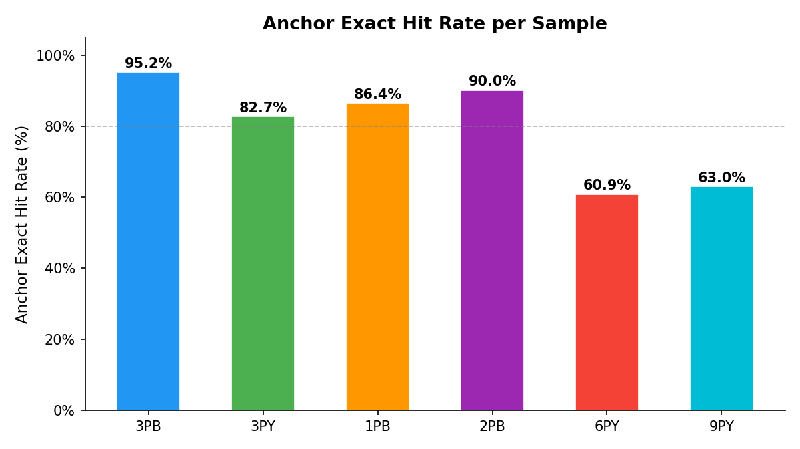
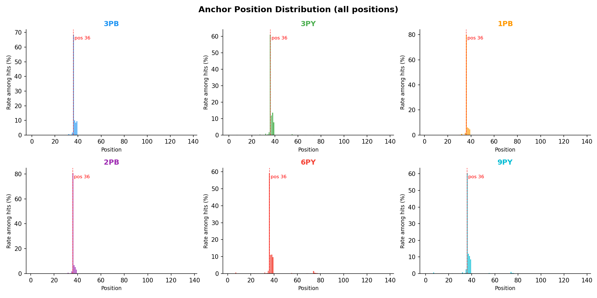
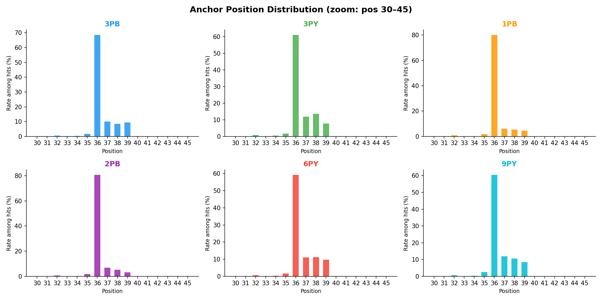

# Anchor Sequence QC Report

**Anchor sequence:** `CACCGTCTCCGCCTC`  
**Samples:** 6  
**Method:** exact string match on R1 reads

---

## 1. Anchor Exact Hit Rate

| Sample | Total R1 Reads | Anchor Hits | Hit Rate |
|--------|---------------|-------------|----------|
| **3PB** | 44,651,052 | 42,511,204 | 95.21% |
| **3PY** | 48,203,211 | 39,853,829 | 82.68% |
| **1PB** | 22,454,402 | 19,401,697 | 86.40% |
| **2PB** | 28,951,354 | 26,061,524 | 90.02% |
| **6PY** | 16,776,373 | 10,214,382 | 60.89% ⚠️ |
| **9PY** | 20,392,336 | 12,847,664 | 63.00% ⚠️ |

> ⚠️ = hit rate below 75%, may indicate library quality issue or different read structure.

---

## 2. Anchor Position Distribution

### 2.1 Overview (all positions)

### 2.2 Zoom: positions 30–45 (dominant peak region)

---

## 3. Per-Sample Peak Summary

| Sample | Peak Position | Peak Rate (%) | pos36 Rate (%) | pos37 Rate (%) | pos38 Rate (%) | pos39 Rate (%) |
|--------|--------------|--------------|---------------|---------------|---------------|---------------|
| **3PB** | 36 | 68.55% | 68.55% | 10.04% | 8.39% | 9.50% |
| **3PY** | 36 | 61.03% | 61.03% | 11.92% | 13.63% | 7.73% |
| **1PB** | 36 | 80.14% | 80.14% | 6.10% | 5.45% | 4.57% |
| **2PB** | 36 | 80.67% | 80.67% | 6.94% | 5.32% | 3.20% |
| **6PY** | 36 | 59.22% | 59.22% | 11.06% | 11.20% | 9.66% |
| **9PY** | 36 | 60.40% | 60.40% | 11.88% | 10.54% | 8.58% |

---

## 4. Observations

- All samples show a dominant peak at **position 36**, consistent with a fixed anchor location in the read structure.
- Secondary peaks at positions 37–39 represent minor positional shifts.
- **6PY** and **9PY** have notably lower hit rates (~61–63%), which may reflect:
  - Higher proportion of reads without the expected library structure
  - Sequencing or ligation artifacts
  - Different sample preparation batches (B vs A)