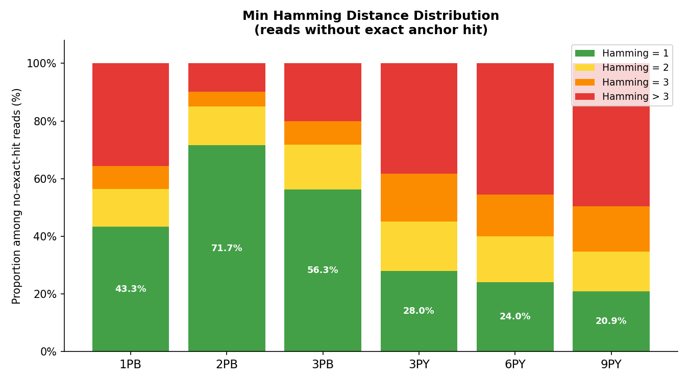
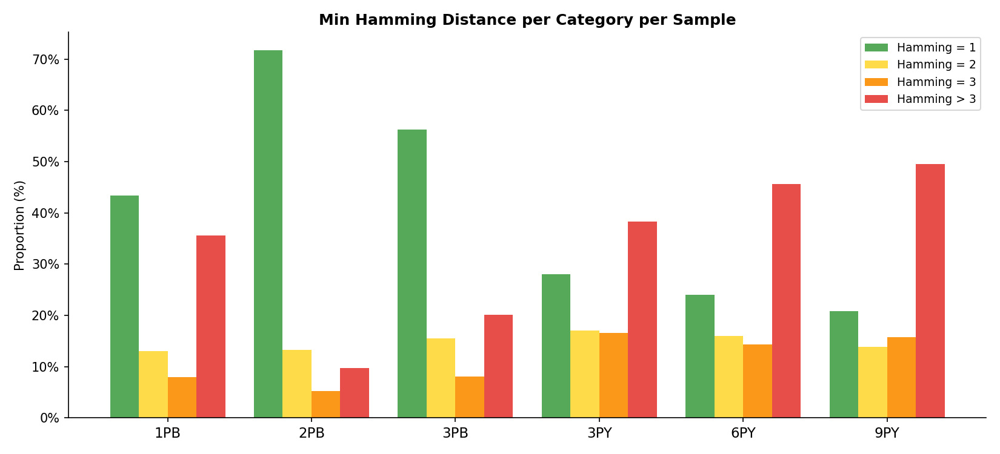
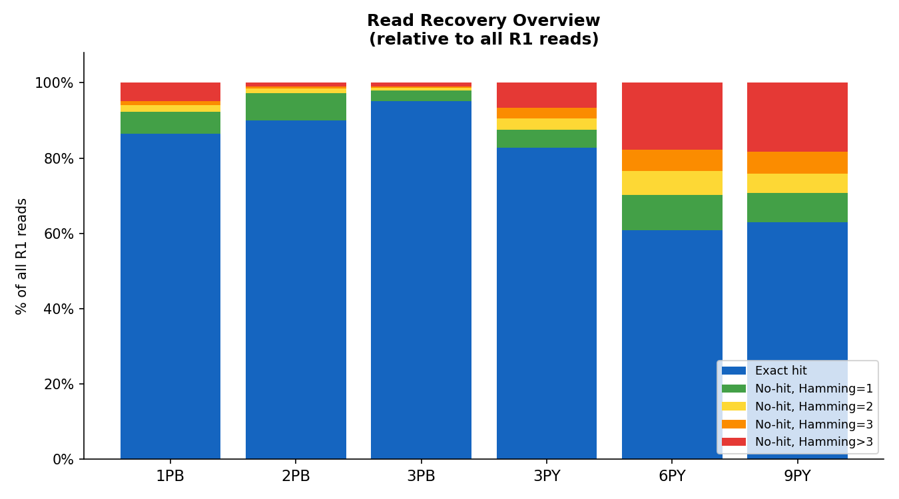

# Anchor Hamming Distance Analysis (Step 2)

**Anchor:** `CACCGTCTCCGCCTC` (15 bp)  
**Scope:** reads without exact anchor hit  
**Method:** sliding window (length 15, pos 33–60, 1-based), minimum Hamming distance  

---

## 1. No-exact-hit Read Counts

| Sample | No-exact-hit Reads |
|--------|--------------------|
| **1PB** | 3,052,705 |
| **2PB** | 2,889,830 |
| **3PB** | 2,139,848 |
| **3PY** | 8,349,382 |
| **6PY** | 6,561,991 |
| **9PY** | 7,544,672 |

---

## 2. Min Hamming Distance Distribution (among no-hit reads)

### 2.1 Stacked bar

### 2.2 Grouped bar

### 2.3 Summary table

| Sample | No-hit Reads | Hamming=1 (%) | Hamming=2 (%) | Hamming=3 (%) | Hamming>3 (%) |
|--------|-------------|--------------|--------------|--------------|--------------|
| **1PB** | 3,052,705 | 43.34% | 13.03% | 7.98% | 35.65% |
| **2PB** | 2,889,830 | 71.69% | 13.28% | 5.26% | 9.77% |
| **3PB** | 2,139,848 | 56.32% | 15.47% | 8.08% | 20.14% |
| **3PY** | 8,349,382 | 28.00% | 17.08% | 16.63% | 38.29% |
| **6PY** | 6,561,991 | 24.03% | 16.05% | 14.33% | 45.59% |
| **9PY** | 7,544,672 | 20.86% | 13.81% | 15.76% | 49.57% |

---

## 3. Read Recovery Overview (relative to all R1 reads)

| Sample | Exact Hit | +Hamming=1 | +Hamming=2 | +Hamming=3 | Lost (>3) |
|--------|-----------|-----------|-----------|-----------|----------|
| **1PB** | 86.4% | 5.9% | 1.8% | 1.1% | 4.8% |
| **2PB** | 90.0% | 7.2% | 1.3% | 0.5% | 1.0% |
| **3PB** | 95.2% | 2.7% | 0.7% | 0.4% | 1.0% |
| **3PY** | 82.7% | 4.8% | 3.0% | 2.9% | 6.6% |
| **6PY** | 60.9% | 9.4% | 6.3% | 5.6% | 17.8% |
| **9PY** | 63.0% | 7.7% | 5.1% | 5.8% | 18.3% |

---

## 4. Observations

- **2PB** has the highest Hamming=1 proportion (71.7%) among no-hit reads, suggesting most misses are single-base sequencing errors — recoverable with 1-mismatch tolerance.
- **6PY** and **9PY** have the largest Hamming>3 fractions (~46–50%), consistent with their low exact hit rates and suggesting genuine structural issues in a large fraction of reads.
- **3PY** also shows elevated Hamming>3 (38%), despite a higher exact hit rate than 6PY/9PY.
- Allowing up to 1 mismatch would recover an additional 20–72% of no-hit reads depending on sample, substantially increasing usable read count.