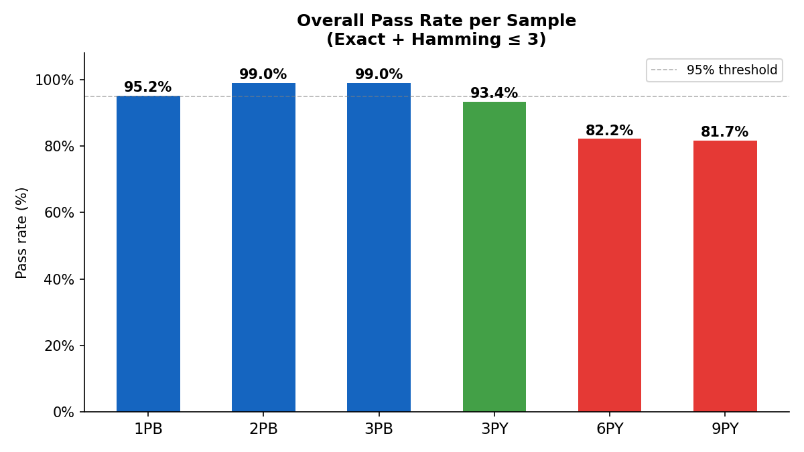
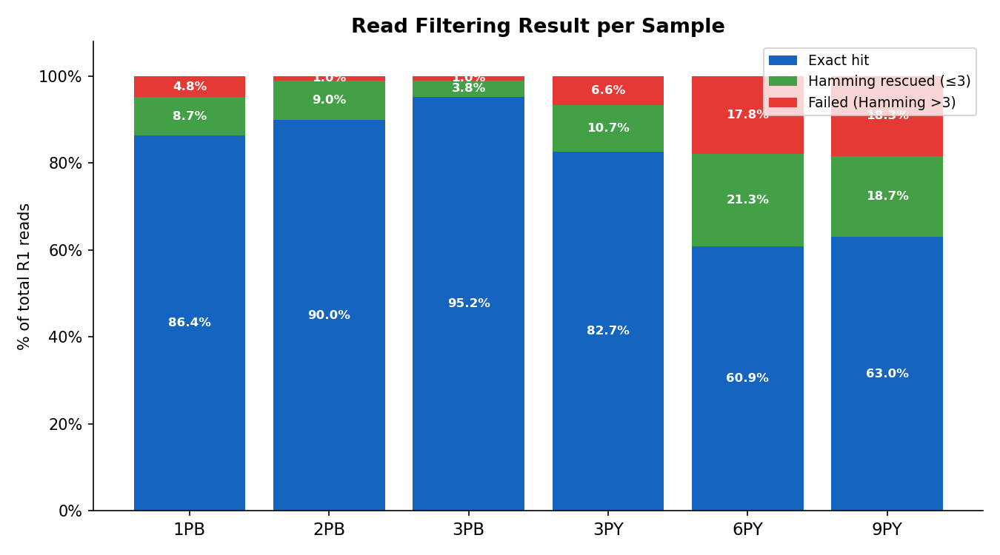
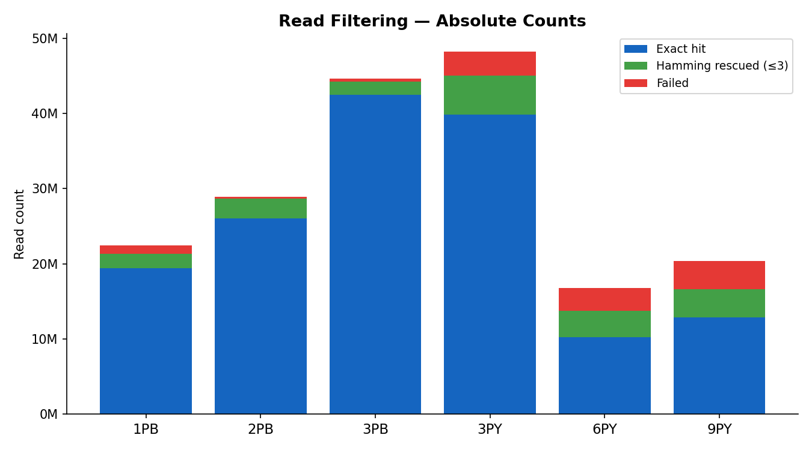

# Read Filtering Report (Step 4)

**Anchor:** `CACCGTCTCCGCCTC` (15 bp)  
**Filter criteria (pass if either):**
1. Exact anchor match anywhere in R1
2. Sliding window pos 33–60 (1-based), length 15: min Hamming ≤ 3  

**Output:** filtered R1 + R2 fastq.gz; capture start position written to read name as `cs:i:{pos} mt:Z:{exact|hamming}`

---

## 1. Pass Rate per Sample

---

## 2. Filtering Breakdown

### 2.1 Proportion of total reads

### 2.2 Absolute read counts

---

## 3. Summary Table

| Sample | Total Reads | Exact Hit | Hamming Rescued | Failed | Pass Rate |
|--------|------------|-----------|-----------------|--------|-----------|
| **1PB** | 22,454,402 | 19,401,697 (86.4%) | 1,964,510 (8.7%) | 1,088,195 (4.8%) | **95.2%** |
| **2PB** | 28,951,354 | 26,061,524 (90.0%) | 2,607,590 (9.0%) | 282,240 (1.0%) | **99.0%** |
| **3PB** | 44,651,052 | 42,511,204 (95.2%) | 1,708,846 (3.8%) | 431,002 (1.0%) | **99.0%** |
| **3PY** | 48,203,211 | 39,853,829 (82.7%) | 5,152,721 (10.7%) | 3,196,661 (6.6%) | **93.4%** |
| **6PY** | 16,776,373 | 10,214,382 (60.9%) | 3,570,623 (21.3%) | 2,991,368 (17.8%) | **82.2%** |
| **9PY** | 20,392,336 | 12,847,664 (63.0%) | 3,804,852 (18.7%) | 3,739,820 (18.3%) | **81.7%** |

---

## 4. Observations

- **2PB** and **3PB** achieve ~99% pass rate — high-quality libraries with consistent anchor placement.
- **Hamming rescue** recovers an additional 1.7M–5.2M reads per sample that would otherwise be discarded.
- **6PY** and **9PY** have the highest failure rates (~18%), consistent with findings in Step 1 and Step 2.
- The `cs:i` tag in each passing read's name records the 1-based anchor start position, enabling downstream barcode/UMI extraction without re-scanning.