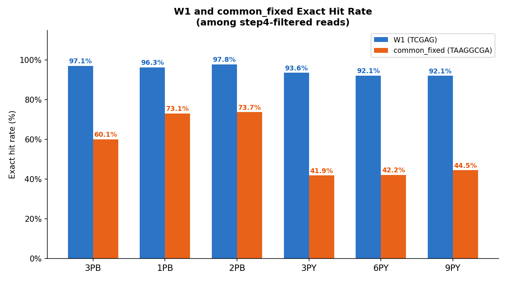
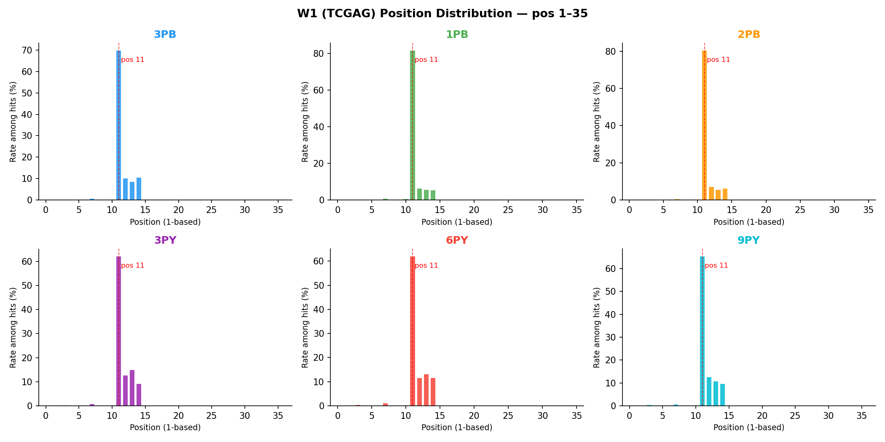
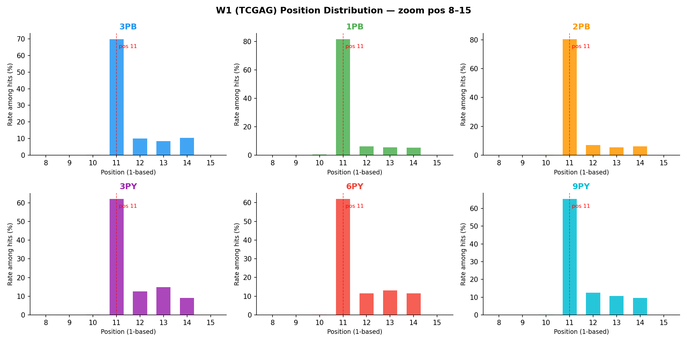
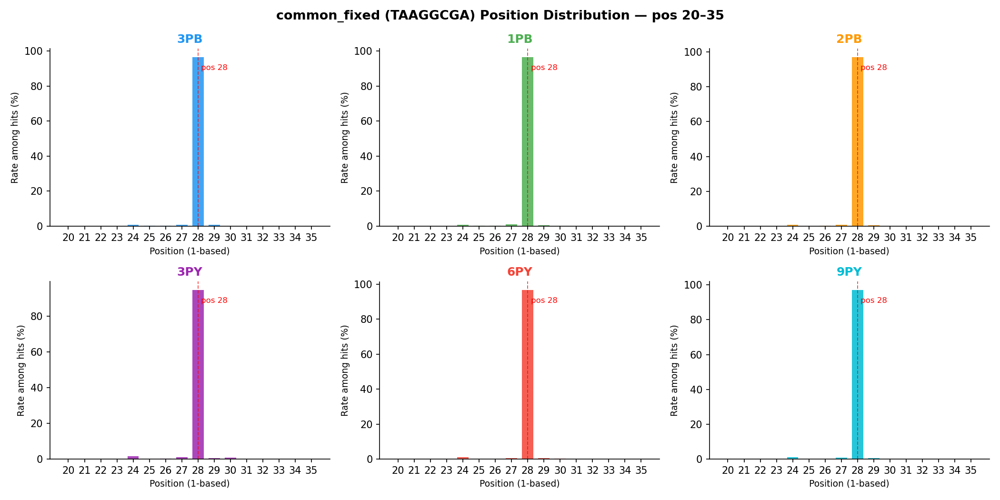

# W1 and common_fixed Exact Hit Report (Step 5)

**Input:** step4-filtered R1 reads (reads with capture seq exact or Hamming ≤ 3)  
**Search region:** pos 1 to (capture_start − 1) (1-based), i.e. everything before the anchor  
**W1:** `TCGAG` (expected at pos 11–15)  
**common_fixed:** `TAAGGCGA` (expected at pos 28–35)  
**Method:** exact string match (`str.find`), first occurrence only

---

## 1. Exact Hit Rates

| Sample | Total Reads | W1 Hit | W1 Rate | common_fixed Hit | CF Rate |
|--------|------------|--------|---------|-----------------|---------|
| **3PB** | 44,220,050 | 42,922,911 | 97.07% | 26,583,833 | 60.12% |
| **1PB** | 21,366,207 | 20,565,836 | 96.25% | 15,619,708 | 73.10% |
| **2PB** | 28,669,114 | 28,052,502 | 97.85% | 21,139,812 | 73.74% |
| **3PY** | 45,006,550 | 42,115,984 | 93.58% | 18,858,589 | 41.90% |
| **6PY** | 13,785,005 | 12,692,918 | 92.08% | 5,820,010 | 42.22% |
| **9PY** | 16,652,516 | 15,329,582 | 92.06% | 7,415,843 | 44.53% |

---

## 2. W1 Position Distribution

### 2.1 Overview (pos 1–35)

### 2.2 Zoom (pos 8–15)

---

## 3. common_fixed Position Distribution (pos 20–35)

---

## 4. Per-Sample Peak Summary

| Sample | W1 peak pos | W1 peak rate | CF peak pos | CF peak rate |
|--------|------------|-------------|------------|-------------|
| **3PB** | 11 | 69.75% | 28 | 96.38% |
| **1PB** | 11 | 81.57% | 28 | 96.41% |
| **2PB** | 11 | 80.31% | 28 | 96.92% |
| **3PY** | 11 | 61.98% | 28 | 94.60% |
| **6PY** | 11 | 61.93% | 28 | 96.63% |
| **9PY** | 11 | 65.31% | 28 | 96.98% |

---

## 5. Observations

- **W1 (`TCGAG`)**: dominant peak at position **11** across all samples, consistent with the expected read structure (BC1 = pos 1–10, W1 = pos 11–15).
- **common_fixed (`TAAGGCGA`)**: dominant peak at position **28**, consistent with the expected structure (BC2 = pos 16–25, UMI_2N = pos 26–27, common_fixed = pos 28–35).
- W1 hit rates are high (92–98%) across all samples, confirming stable linker structure.
- common_fixed hit rates are lower (42–73%), which is expected since `TAAGGCGA` is 8 bp and shares bases with barcode regions; some reads may carry sequence variants at BC2/UMI that create false misses.
- **6PY** and **9PY** show lower common_fixed hit rates (~42–45%), consistent with their lower overall anchor quality seen in step 1–4.