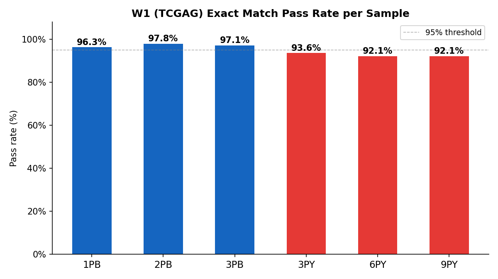
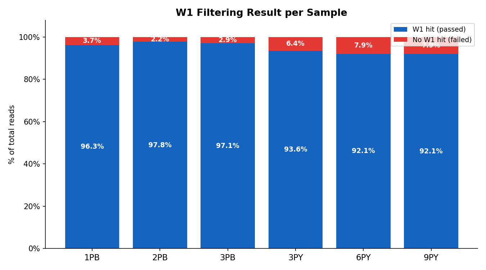
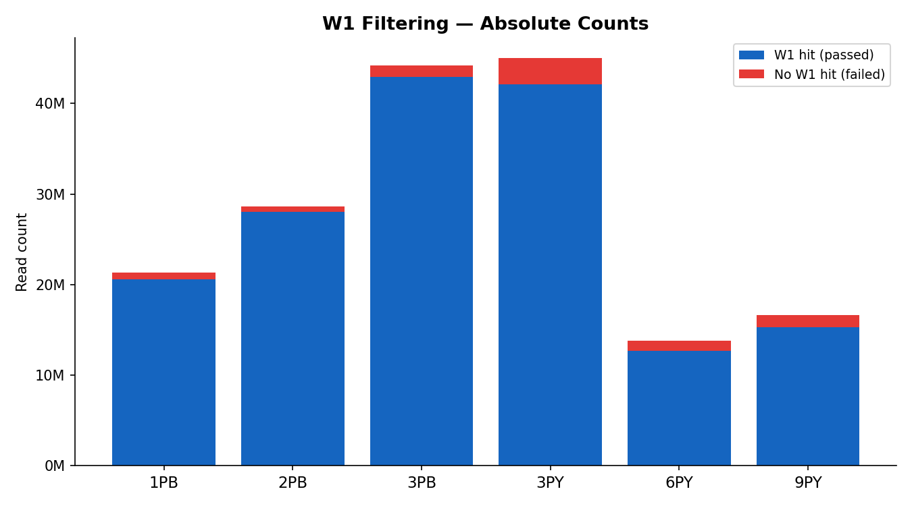

# W1 Filtering Report (Step 6)

**Input:** step4-filtered reads (`*_filtered_R1/R2.fq.gz`)

**Filter criterion:** exact match of W1 (`TCGAG`, 5 bp) in the region before the capture sequence start (`cs:i` position)

**Output:** `*_W1_R1/R2.fq.gz`; W1 start position written to R1 read name as `w1:i:{pos}` (1-based)

---

## 1. Pass Rate per Sample

---

## 2. Filtering Breakdown

### 2.1 Proportion of total reads

### 2.2 Absolute read counts

---

## 3. Summary Table

| Sample | Total Reads | Passed (W1 hit) | Failed | Pass Rate |
|--------|------------|-----------------|--------|-----------|
| **1PB** | 21,366,207 | 20,565,836 (96.25%) | 800,371 (3.75%) | **96.25%** |
| **2PB** | 28,669,114 | 28,052,502 (97.85%) | 616,612 (2.15%) | **97.85%** |
| **3PB** | 44,220,050 | 42,922,911 (97.07%) | 1,297,139 (2.93%) | **97.07%** |
| **3PY** | 45,006,550 | 42,115,984 (93.58%) | 2,890,566 (6.42%) | **93.58%** |
| **6PY** | 13,785,005 | 12,692,918 (92.08%) | 1,092,087 (7.92%) | **92.08%** |
| **9PY** | 16,652,516 | 15,329,582 (92.06%) | 1,322,934 (7.94%) | **92.06%** |

---

## 4. Observations

- **PB batch** (1PB, 2PB, 3PB): W1 pass rates 96–98%, consistent with step5 exact hit survey.
- **PY batch** (3PY, 6PY, 9PY): slightly lower at 92–94%, but still high enough for reliable barcode extraction.
- The ~4–6% gap between PB and PY batches is consistent across all upstream steps and likely reflects library quality differences.
- The `w1:i` tag in each passing read's name records the 1-based W1 start position alongside the existing `cs:i` and `mt:Z` tags, enabling downstream barcode extraction without re-scanning.