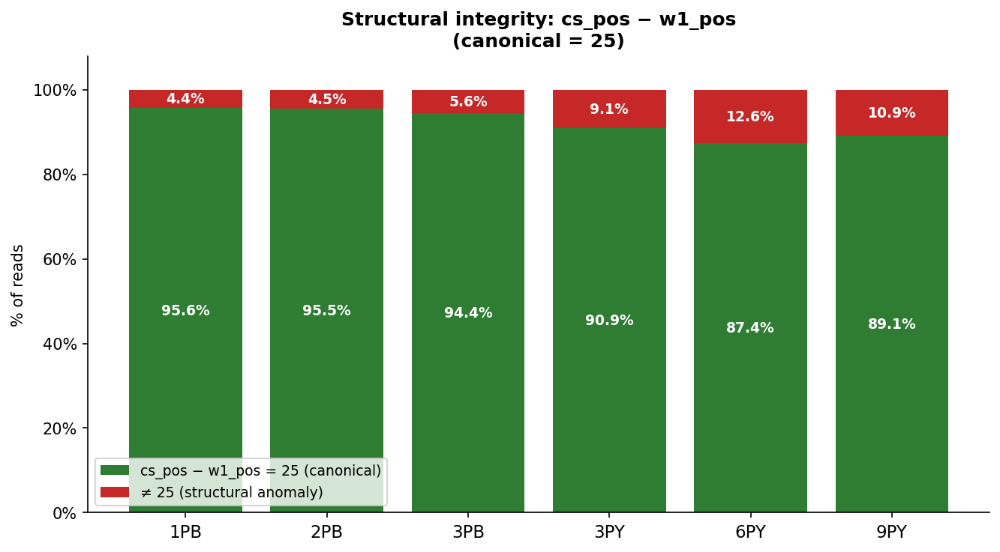
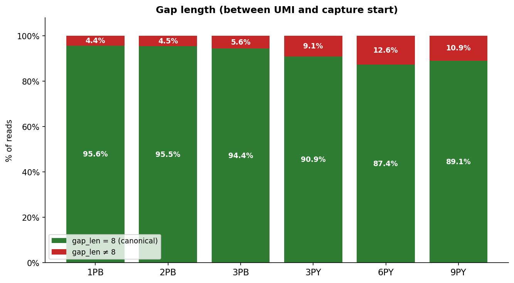
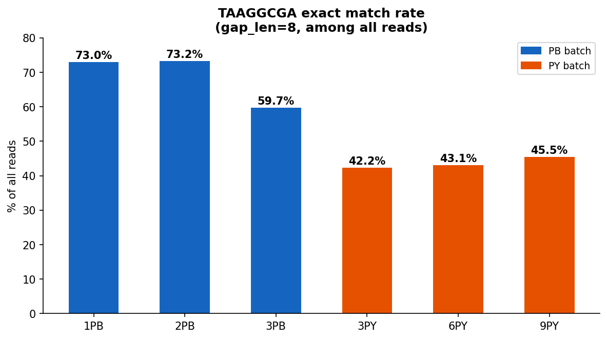
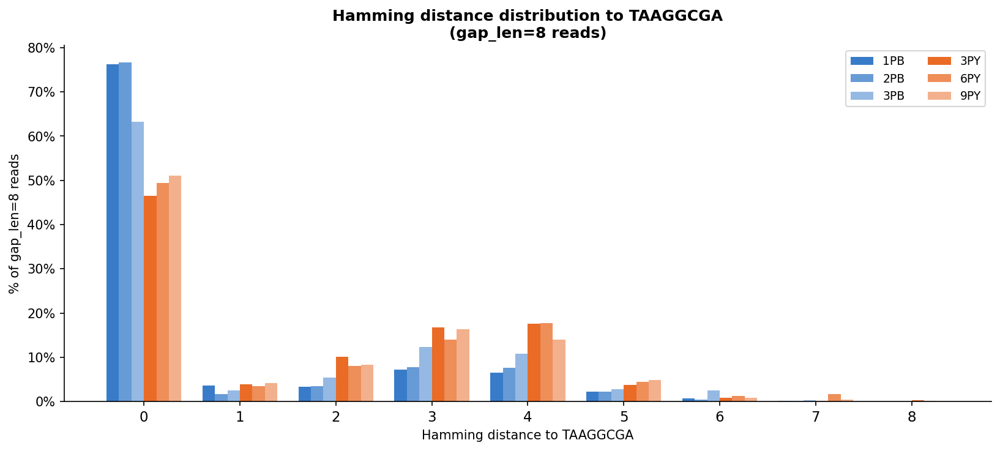
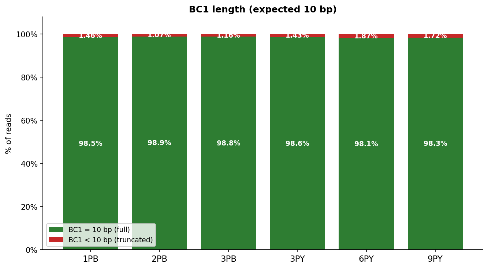

# Step 7 Analysis Report — Barcode / UMI Extraction QC

**Input:** step6 W1-filtered reads (`*_W1_R1.fq.gz`)

**Reference common_fixed:** `TAAGGCGA` (8 bp, known for PB batch)

---

## 1. Structural Integrity — cs_pos − w1_pos

Expected value: **25** (canonical read structure).  
Deviation indicates indels or a mis-anchored capture position.

| Sample | cs−w1=25 | cs−w1=24 | cs−w1=26 | cs−w1≥27 or ≤23 |
|--------|----------|----------|----------|-----------------|
| **1PB** | 95.6% (19,670,296) | 2.8% (568,210) | 0.4% (74,763) | 1.2% (252,567) |
| **2PB** | 95.5% (26,777,059) | 3.1% (859,015) | 0.4% (117,939) | 1.1% (298,489) |
| **3PB** | 94.4% (40,529,623) | 4.0% (1,709,077) | 0.6% (239,732) | 1.0% (444,479) |
| **3PY** | 90.9% (38,264,142) | 4.9% (2,046,001) | 1.1% (448,604) | 3.2% (1,357,237) |
| **6PY** | 87.4% (11,087,504) | 6.5% (823,815) | 0.5% (62,453) | 5.7% (719,146) |
| **9PY** | 89.1% (13,654,593) | 5.6% (856,882) | 0.5% (78,827) | 4.8% (739,280) |

---

## 2. Gap Length Distribution

Gap = sequence between UMI end and capture start.  
Canonical length: **8 bp** (common_fixed region).  
gap_len ≠ 8 implies an indel in common_fixed or a misidentified capture position.

| Sample | gap=8 | gap=7 | gap=9 | gap≤6 or ≥10 |
|--------|-------|-------|-------|--------------|
| **1PB** | 95.6% (19,670,296) | 2.8% (568,210) | 0.4% (74,763) | 1.2% (252,567) |
| **2PB** | 95.5% (26,777,059) | 3.1% (859,015) | 0.4% (117,939) | 1.1% (298,489) |
| **3PB** | 94.4% (40,529,623) | 4.0% (1,709,077) | 0.6% (239,732) | 1.0% (444,479) |
| **3PY** | 90.9% (38,264,142) | 4.9% (2,046,001) | 1.1% (448,604) | 3.2% (1,357,237) |
| **6PY** | 87.4% (11,087,504) | 6.5% (823,815) | 0.5% (62,453) | 5.7% (719,146) |
| **9PY** | 89.1% (13,654,593) | 5.6% (856,882) | 0.5% (78,827) | 4.8% (739,280) |

---

## 3. TAAGGCGA Match Rate

Exact match of gap_seq to `TAAGGCGA` among all reads.

| Sample | Batch | Total | TAAGGCGA exact | Rate |
|--------|-------|-------|----------------|------|
| **1PB** | PB | 20,565,836 | 15,006,207 | **73.0%** |
| **2PB** | PB | 28,052,502 | 20,533,973 | **73.2%** |
| **3PB** | PB | 42,922,911 | 25,638,244 | **59.7%** |
| **3PY** | PY | 42,115,984 | 17,792,939 | **42.2%** |
| **6PY** | PY | 12,692,918 | 5,470,490 | **43.1%** |
| **9PY** | PY | 15,329,582 | 6,975,629 | **45.5%** |

---

## 4. Hamming Distance to TAAGGCGA

Computed for gap_len=8 reads only.

| Sample | HD=0 | HD=1 | HD=2 | HD=3 | HD=4 | HD≥5 |
|--------|------|------|------|------|------|------|
| **1PB** | 76.3% | 3.6% | 3.4% | 7.1% | 6.5% | 3.1% |
| **2PB** | 76.7% | 1.6% | 3.5% | 7.7% | 7.7% | 2.8% |
| **3PB** | 63.3% | 2.5% | 5.4% | 12.4% | 10.9% | 5.5% |
| **3PY** | 46.5% | 3.9% | 10.1% | 16.7% | 17.6% | 5.1% |
| **6PY** | 49.3% | 3.5% | 8.0% | 14.0% | 17.7% | 7.4% |
| **9PY** | 51.1% | 4.2% | 8.3% | 16.4% | 13.9% | 6.1% |

---

## 5. BC1 Length Distribution

BC1 is extracted as the 10 nt before W1.  
BC1 < 10 bp occurs when W1 is within 10 bp of the read start.

| Sample | BC1=10 bp | BC1<10 bp | Min BC1 len |
|--------|-----------|-----------|-------------|
| **1PB** | 98.54% (20,265,407) | 1.46% (300,429) | 0 |
| **2PB** | 98.93% (27,751,542) | 1.07% (300,960) | 0 |
| **3PB** | 98.84% (42,426,091) | 1.16% (496,820) | 0 |
| **3PY** | 98.57% (41,515,644) | 1.43% (600,340) | 0 |
| **6PY** | 98.13% (12,455,809) | 1.87% (237,109) | 0 |
| **9PY** | 98.28% (15,066,088) | 1.72% (263,494) | 0 |

---

## 6. Key Findings

### 6.1 PY batch has low TAAGGCGA rate and highly diverse gap sequences

- PB samples: 60–73% TAAGGCGA exact match.  
- PY samples: 42–46% TAAGGCGA exact match — the remaining ~54% carry highly diverse 8-mer sequences.  
- This confirms that **PY's common_fixed is NOT a fixed sequence**: either the region encodes a variable barcode, or a different library preparation was used.

### 6.5 3PB is an outlier within the PB batch

- 1PB and 2PB have TAAGGCGA rates of **73%** (HD=0: ~76%); 3PB is notably lower at **59.7%** (HD=0: 63.3%).
- 3PB also has a higher gap_len≠8 rate (5.6%) and more large-gap anomalies than the other two PB samples.
- This may reflect lower library quality for 3PB, consistent with it having the lowest pass rate in step 1 (95.2% vs ~99% for 1PB/2PB).

### 6.2 ~4–9% of reads have gap_len ≠ 8

- Most anomalies are gap_len=7 (−1 bp): likely a 1-bp deletion in the common_fixed region or a 1-bp shift in the Hamming-rescued capture position.
- A small fraction of PY reads have very large gaps (cs_pos−w1_pos = 44, 56, 63…), indicating that the Hamming rescue identified a false-positive capture position far downstream.

### 6.3 PY Hamming distance distribution is flat

- For PB, Hamming distance to TAAGGCGA is bimodal: HD=0 dominates (~60%), then a near-flat tail.
- For PY, HD=0 is ~42% and the distribution is nearly uniform across HD 1–8, consistent with random sequence rather than a single alternative fixed sequence.

### 6.4 BC1 truncation is rare

- < 1% of reads have BC1 < 10 bp (W1 appears within 10 bp of the read start).  
- These reads can be excluded from downstream cell barcode analysis without significant loss.