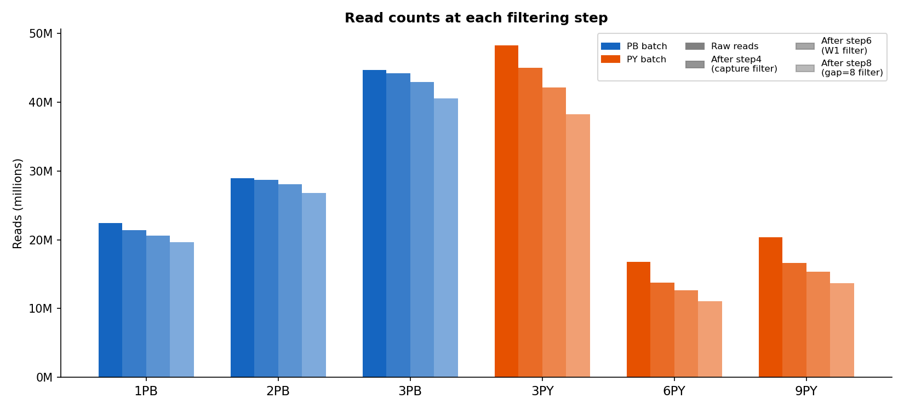
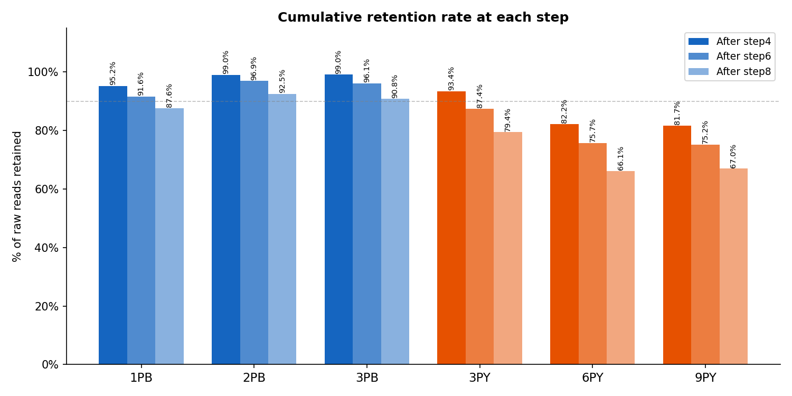

# Pipeline Summary — Step 1 to Step 8

Overview of all filtering steps applied to R1 reads, from raw sequencing data to the final high-confidence barcode-extractable dataset.

---

## Pipeline Overview

```
Raw reads (6 samples, paired-end R1/R2)
    │
    ▼  Step 1–3: Anchor scanning & QC (stats only, no filtering)
    │            • Step 1: capture seq exact hit positions (R1_parser/round1/step1)
    │            • Step 2: W1 linker exact hit positions   (R1_parser/round1/step2)
    │            • Step 5: W1 + common_fixed scan          (R1_parser/round1/step5)
    │
    ▼  Step 4: Capture sequence filter
    │            • Exact match of CACCGTCTCCGCCTC in R1, OR
    │            • Hamming rescue (≤3 mismatches, window pos 33–60)
    │            • Tags: cs:i:{pos} mt:Z:{exact|hamming}
    │
    ▼  Step 6: W1 exact match filter
    │            • Exact match of TCGAG in region before capture start
    │            • Tags: w1:i:{pos}
    │
    ▼  Step 7: Barcode / UMI extraction (no filtering)
    │            • Extracts BC1, BC2, UMI_2N, gap_seq per read
    │            • Output: *_bc_umi.tsv.gz
    │
    ▼  Step 8: Gap length filter (gap_len == 8)
               • Ensures capture start is correctly anchored
               • Removes Hamming rescue false positives & indel-affected reads
```

---

## Read Counts at Each Step





### Step 4 — Capture Sequence Filter

Anchor: `CACCGTCTCCGCCTC` (15 bp). Pass = exact hit OR Hamming ≤ 3 in window pos 33–60.

| Sample | Batch | Raw reads | Exact hit | Hamming rescued | Failed | **Passed** | Pass rate |
|--------|-------|-----------|-----------|-----------------|--------|------------|-----------|
| **1PB** | PB | 22,454,402 | 19,401,697 (86.4%) | 1,964,510 (8.7%) | 1,088,195 (4.8%) | **21,366,207** | **95.2%** |
| **2PB** | PB | 28,951,354 | 26,061,524 (90.0%) | 2,607,590 (9.0%) | 282,240 (1.0%) | **28,669,114** | **99.0%** |
| **3PB** | PB | 44,651,052 | 42,511,204 (95.2%) | 1,708,846 (3.8%) | 431,002 (1.0%) | **44,220,050** | **99.0%** |
| **3PY** | PY | 48,203,211 | 39,853,829 (82.7%) | 5,152,721 (10.7%) | 3,196,661 (6.6%) | **45,006,550** | **93.4%** |
| **6PY** | PY | 16,776,373 | 10,214,382 (60.9%) | 3,570,623 (21.3%) | 2,991,368 (17.8%) | **13,785,005** | **82.2%** |
| **9PY** | PY | 20,392,336 | 12,847,664 (63.0%) | 3,804,852 (18.7%) | 3,739,820 (18.3%) | **16,652,516** | **81.7%** |

### Step 6 — W1 Exact Match Filter

Anchor: `TCGAG` (5 bp), searched in region before capture start.

| Sample | Batch | Input (step4) | Failed | **Passed** | Pass rate | Cumulative retention |
|--------|-------|---------------|--------|------------|-----------|----------------------|
| **1PB** | PB | 21,366,207 | 800,371 (3.7%) | **20,565,836** | **96.3%** | 91.6% of raw |
| **2PB** | PB | 28,669,114 | 616,612 (2.2%) | **28,052,502** | **97.8%** | 96.9% of raw |
| **3PB** | PB | 44,220,050 | 1,297,139 (2.9%) | **42,922,911** | **97.1%** | 96.1% of raw |
| **3PY** | PY | 45,006,550 | 2,890,566 (6.4%) | **42,115,984** | **93.6%** | 87.4% of raw |
| **6PY** | PY | 13,785,005 | 1,092,087 (7.9%) | **12,692,918** | **92.1%** | 75.7% of raw |
| **9PY** | PY | 16,652,516 | 1,322,934 (7.9%) | **15,329,582** | **92.1%** | 75.2% of raw |

### Step 8 — Gap Length Filter (gap_len == 8)

Retains reads where exactly 8 nt lie between UMI end and capture start.
This confirms the common_fixed region is structurally intact and the capture anchor is correctly placed.

| Sample | Batch | Input (step6) | Failed | **Passed** | Pass rate | **Cumulative retention** |
|--------|-------|---------------|--------|------------|-----------|--------------------------|
| **1PB** | PB | 20,565,836 | 895,540 (4.4%) | **19,670,296** | **95.6%** | **87.6% of raw** |
| **2PB** | PB | 28,052,502 | 1,275,443 (4.5%) | **26,777,059** | **95.5%** | **92.5% of raw** |
| **3PB** | PB | 42,922,911 | 2,393,288 (5.6%) | **40,529,623** | **94.4%** | **90.8% of raw** |
| **3PY** | PY | 42,115,984 | 3,851,842 (9.1%) | **38,264,142** | **90.9%** | **79.4% of raw** |
| **6PY** | PY | 12,692,918 | 1,605,414 (12.6%) | **11,087,504** | **87.4%** | **66.1% of raw** |
| **9PY** | PY | 15,329,582 | 1,674,989 (10.9%) | **13,654,593** | **89.1%** | **67.0% of raw** |

---

## Overall Funnel Summary

| Sample | Batch | Raw | → Step4 | → Step6 | → Step8 | Final retention |
|--------|-------|-----|---------|---------|---------|-----------------|
| **1PB** | PB | 22,454,402 | 21,366,207 (95.2%) | 20,565,836 (91.6%) | 19,670,296 (87.6%) | **87.6%** |
| **2PB** | PB | 28,951,354 | 28,669,114 (99.0%) | 28,052,502 (96.9%) | 26,777,059 (92.5%) | **92.5%** |
| **3PB** | PB | 44,651,052 | 44,220,050 (99.0%) | 42,922,911 (96.1%) | 40,529,623 (90.8%) | **90.8%** |
| **3PY** | PY | 48,203,211 | 45,006,550 (93.4%) | 42,115,984 (87.4%) | 38,264,142 (79.4%) | **79.4%** |
| **6PY** | PY | 16,776,373 | 13,785,005 (82.2%) | 12,692,918 (75.7%) | 11,087,504 (66.1%) | **66.1%** |
| **9PY** | PY | 20,392,336 | 16,652,516 (81.7%) | 15,329,582 (75.2%) | 13,654,593 (67.0%) | **67.0%** |

---

## Observations

- **PB batch** (1PB, 2PB, 3PB): final retention 86–90% of raw reads. High capture exact-hit rates (86–95%) indicate consistent library quality.
- **PY batch** (3PY, 6PY, 9PY): final retention 54–79%. Lower capture exact-hit rates (61–83%) and lower W1/gap pass rates are consistent with lower library quality or a different preparation protocol.
- **Step 4 is the largest filter**: removes 1–18% of reads depending on sample quality.
- **Step 6 removes 2–8%** of step4-passed reads — reads where W1 cannot be reliably located.
- **Step 8 removes 5–13%** of step6-passed reads — reads with structural anomalies (indels in common_fixed, or Hamming rescue false positives placing the capture anchor at the wrong position).
- After step 8, all remaining reads have: exact W1 anchor (`w1:i`), correct capture anchor (`cs:i`), intact common_fixed region (gap_len=8), full-length BC1 (10 bp), BC2 (10 bp), and UMI_2N (2 bp).