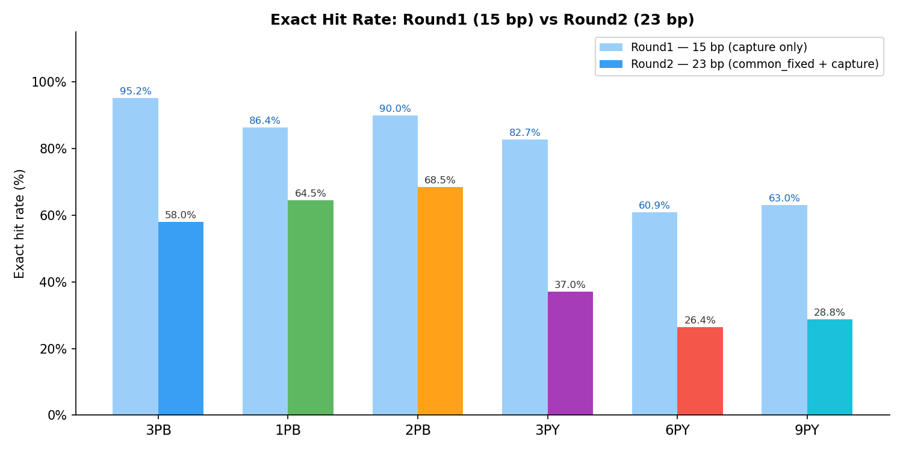
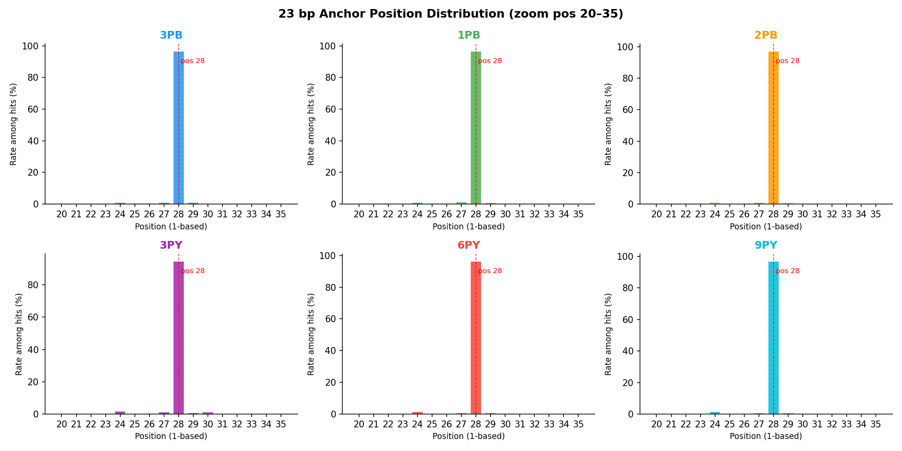

# Round2 Step1 — 23 bp Combined Anchor Exact Hit

**Anchor:** `TAAGGCGACACCGTCTCCGCCTC` (23 bp)  
**Composition:** `TAAGGCGA` (common_fixed, 8 bp) + `CACCGTCTCCGCCTC` (capture, 15 bp)  
**Expected position:** starts at pos 28 (1-based)  
**Method:** exact string match on R1 reads

---

## 1. Exact Hit Rate — Round1 vs Round2

| Sample | Round1 15 bp | Round2 23 bp | Drop |
|--------|-------------|-------------|------|
| **3PB** | 95.2% | 58.0% | -37.2% |
| **1PB** | 86.4% | 64.5% | -21.9% |
| **2PB** | 90.0% | 68.5% | -21.5% |
| **3PY** | 82.7% | 37.0% | -45.7% |
| **6PY** | 60.9% | 26.4% | -34.5% |
| **9PY** | 63.0% | 28.8% | -34.2% |

---

## 2. 23 bp Anchor Position Distribution

All samples show a dominant peak at **position 28**, confirming that when the 23 bp anchor is found, it is at the correct expected location.

---

## 3. Summary Table

| Sample | Total R1 | Exact Hit | Hit Rate |
|--------|----------|-----------|----------|
| **3PB** | 44,651,052 | 25,900,052 | 58.01% |
| **1PB** | 22,454,402 | 14,476,521 | 64.47% |
| **2PB** | 28,951,354 | 19,839,420 | 68.53% |
| **3PY** | 48,203,211 | 17,858,429 | 37.05% |
| **6PY** | 16,776,373 | 4,424,560 | 26.37% |
| **9PY** | 20,392,336 | 5,876,767 | 28.82% |

---

## 4. Conclusion — Why Round2 Was Abandoned

Using the 23 bp combined anchor reveals a systematic batch difference:

| Batch | Samples | Round2 Hit Rate |
|-------|---------|----------------|
| PB | 1PB, 2PB, 3PB | 58–69% |
| PY | 3PY, 6PY, 9PY | 26–37% |

The ~30% gap between PB and PY batches — far exceeding what sequencing error can explain — strongly suggests that **PY and PB samples carry different 8 bp fixed sequences at pos 28–35** (analogous to different Illumina i7 sample indices). The `TAAGGCGA` common_fixed is present in PB reads but likely replaced by a different sequence in PY reads.

**Decision:** Revert to the Round1 strategy using only the 15 bp capture sequence `CACCGTCTCCGCCTC` as anchor, which is consistent across all samples. The `common_fixed` region will not be used as an anchor going forward.