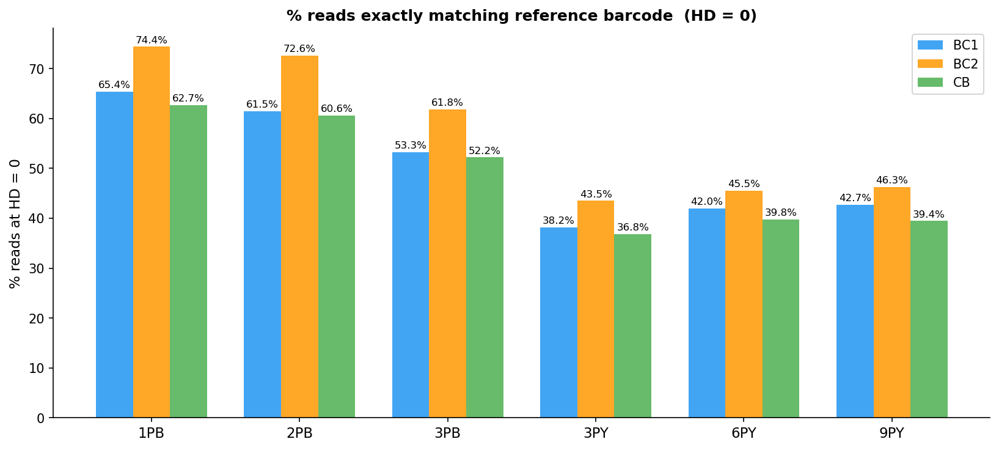
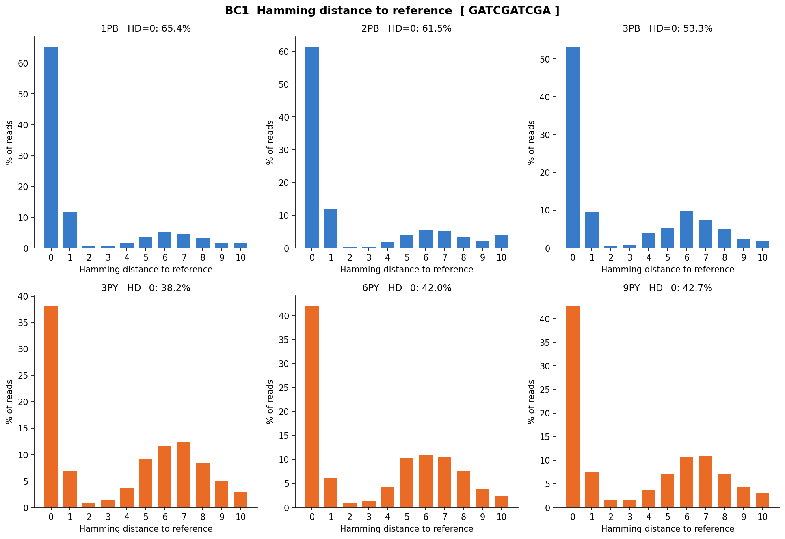
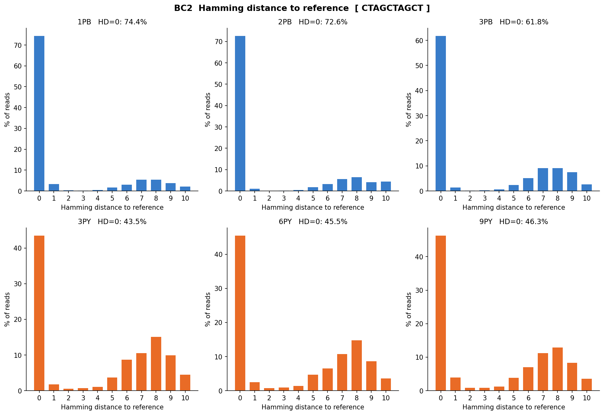
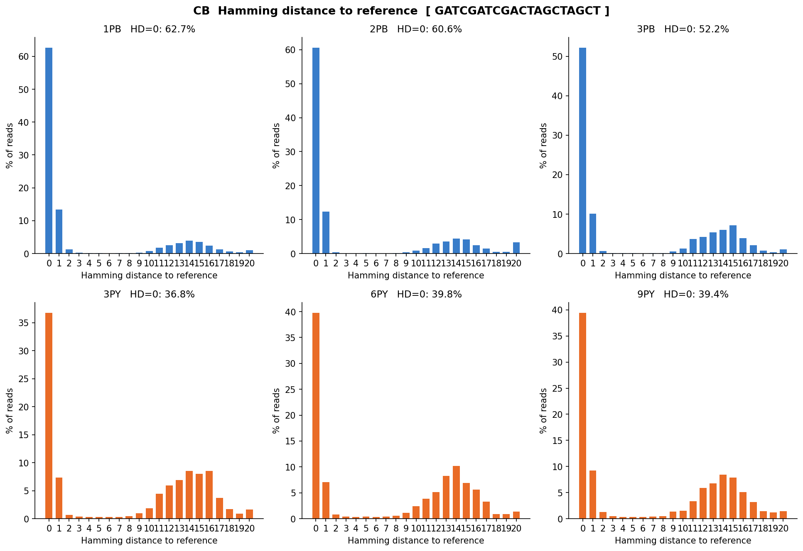

# Barcode Statistics Report

**Input:** filter_HD2 R1 reads (HD≤2 + W1 exact hit + gap=20)  
**Cell barcode:** BC1 (10 bp) + BC2 (10 bp) = 20 bp combined (CB)

---

## 1. Summary Table

| Sample | Total reads | Unique BC1 | Unique BC2 | Unique CB | Median reads/CB | Mean reads/CB |
|--------|------------|------------|------------|-----------|-----------------|---------------|
| **1PB** | 19,304,120 | 61,464 | 52,222 | 298,126 | 1 | 64.8 |
| **2PB** | 26,498,256 | 37,546 | 30,733 | 188,647 | 1 | 140.5 |
| **3PB** | 40,101,821 | 89,398 | 78,206 | 573,965 | 1 | 69.9 |
| **3PY** | 37,682,637 | 275,680 | 305,150 | 1,795,272 | 1 | 21.0 |
| **6PY** | 10,561,326 | 166,405 | 191,988 | 771,376 | 1 | 13.7 |
| **9PY** | 12,862,720 | 195,995 | 219,217 | 981,713 | 1 | 13.1 |

---

## 2. Unique Cell Barcodes (BC1+BC2)

---

## 3. Median Reads per Cell Barcode

---

## 4. Knee Plot

Read count vs rank for the top 1,000 cell barcodes (log-log scale).  
A steep drop-off indicates a clear separation between real cells and background.

---

## 5. Observations

- PB samples have 188,647–573,965 unique cell barcodes; PY samples have 771,376–1,795,272.
- Median reads per CB: PB 1–1, PY 1–1.
- The knee plot shape indicates whether a clear cell/background boundary exists. A sharp elbow suggests good library complexity; a flat curve suggests many low-count barcodes.
- High unique CB counts with low median reads per CB typically indicate a large fraction of background/empty droplets — downstream cell calling (e.g., ArchR, snapATAC2) will apply a count threshold to separate real cells.

---

## 6. Top 20 Barcodes per Sample

### 1PB

**Top 20 CB**

| Rank | Sequence | Count |
|------|----------|-------|
| 1 | `GATCGATCGACTAGCTAGCT` | 12,096,293 |
| 2 | `CATCGATCGACTAGCTAGCT` | 931,702 |
| 3 | `TATCGATCGACTAGCTAGCT` | 746,246 |
| 4 | `GATCGATCGAGTAGCTAGCT` | 217,384 |
| 5 | `ACGTACGTACACGTACGTAC` | 129,219 |
| 6 | `AATCGATCGACTAGCTAGCT` | 48,654 |
| 7 | `GATCGATTGACTAGCTAGCT` | 40,199 |
| 8 | `GATCGATCAACTAGCTAGCT` | 35,339 |
| 9 | `GATCTATCGACTAGCTAGCT` | 33,659 |
| 10 | `GATCAATCGACTAGCTAGCT` | 32,640 |
| 11 | `CGAAGTACGACGAGCAGATT` | 31,433 |
| 12 | `CTGAACGCAAGCTAAGTCAC` | 28,966 |
| 13 | `GATCGATCGATTAGCTAGCT` | 28,755 |
| 14 | `GATCGATCTACTAGCTAGCT` | 27,666 |
| 15 | `GATCGATCGACGAGCTAGCT` | 26,768 |
| 16 | `ATCGATCGATATCGATCGAT` | 26,387 |
| 17 | `GATTGATCGACTAGCTAGCT` | 25,337 |
| 18 | `CCTGCCTCCTCCAAGTTAGC` | 25,277 |
| 19 | `GATCGATCGACTAGCTAGTT` | 24,797 |
| 20 | `TTCGTCGCAATGTTCGCACT` | 22,516 |

**Top 20 BC1**

| Rank | Sequence | Count |
|------|----------|-------|
| 1 | `GATCGATCGA` | 12,616,610 |
| 2 | `CATCGATCGA` | 983,073 |
| 3 | `TATCGATCGA` | 772,376 |
| 4 | `ACGTACGTAC` | 170,664 |
| 5 | `AATCGATCGA` | 53,895 |
| 6 | `GATCGATTGA` | 43,817 |
| 7 | `GATCGATCAA` | 37,638 |
| 8 | `GATCTATCGA` | 35,833 |
| 9 | `GATCAATCGA` | 35,273 |
| 10 | `CGAAGTACGA` | 35,269 |
| 11 | `ATCGATCGAT` | 30,411 |
| 12 | `CTGAACGCAA` | 29,616 |
| 13 | `GATCGATCTA` | 29,254 |
| 14 | `CGGACACCGA` | 28,770 |
| 15 | `GATTGATCGA` | 28,449 |
| 16 | `CCTGCCTCCT` | 28,088 |
| 17 | `TTCGTCGCAA` | 25,459 |
| 18 | `GTTCGATCGA` | 24,721 |
| 19 | `CTACTCTTGA` | 23,082 |
| 20 | `CGAGATGCGA` | 22,204 |

**Top 20 BC2**

| Rank | Sequence | Count |
|------|----------|-------|
| 1 | `CTAGCTAGCT` | 14,358,620 |
| 2 | `GTAGCTAGCT` | 266,877 |
| 3 | `ACGTACGTAC` | 166,641 |
| 4 | `CGAGCAGATT` | 43,755 |
| 5 | `CGAGCTAGCT` | 40,635 |
| 6 | `CCAAGTTAGC` | 33,997 |
| 7 | `TTAGCTAGCT` | 33,830 |
| 8 | `GCTAAGTCAC` | 33,023 |
| 9 | `CTAGCTAGTT` | 30,490 |
| 10 | `TGTTCGCACT` | 29,243 |
| 11 | `ATCGATCGAT` | 28,687 |
| 12 | `AAGTTAATGG` | 23,746 |
| 13 | `CAAGCTAGCT` | 23,433 |
| 14 | `GAACTAGGCT` | 23,366 |
| 15 | `CACACTGCAT` | 23,157 |
| 16 | `CTAGCTAGCA` | 22,502 |
| 17 | `CTAGCTAGCC` | 20,185 |
| 18 | `CTCTGGTCTA` | 19,570 |
| 19 | `CTAGTTAGCT` | 19,354 |
| 20 | `CTGGCTAGCT` | 19,005 |

### 2PB

**Top 20 CB**

| Rank | Sequence | Count |
|------|----------|-------|
| 1 | `GATCGATCGACTAGCTAGCT` | 16,063,762 |
| 2 | `CATCGATCGACTAGCTAGCT` | 1,594,494 |
| 3 | `TATCGATCGACTAGCTAGCT` | 1,129,280 |
| 4 | `ACGTACGTACACGTACGTAC` | 754,001 |
| 5 | `CTGCGTCACACAGCCGTTAA` | 153,308 |
| 6 | `CAGTAAGCGAATTCTCTTAG` | 128,142 |
| 7 | `AGCCTGTCGAAGCCACATCT` | 79,268 |
| 8 | `ACGTAAGTACACGTACGTAC` | 53,161 |
| 9 | `GATCGATTGACTAGCTAGCT` | 49,776 |
| 10 | `AATCGATCGACTAGCTAGCT` | 41,531 |
| 11 | `ATCGATCGATATCGATCGAT` | 40,629 |
| 12 | `GATCAATCGACTAGCTAGCT` | 36,291 |
| 13 | `GATCTATCGACTAGCTAGCT` | 36,124 |
| 14 | `GATCGATCAACTAGCTAGCT` | 35,964 |
| 15 | `GATCGATCGATTAGCTAGCT` | 33,028 |
| 16 | `GATCGATCGACTAGCTAGTT` | 30,817 |
| 17 | `GATTGATCGACTAGCTAGCT` | 27,758 |
| 18 | `GATCGATCTACTAGCTAGCT` | 26,422 |
| 19 | `AAGCCTTATACCTGGCGGCA` | 25,949 |
| 20 | `CGAGAATCTTTGAAGCAGAT` | 25,436 |

**Top 20 BC1**

| Rank | Sequence | Count |
|------|----------|-------|
| 1 | `GATCGATCGA` | 16,291,462 |
| 2 | `CATCGATCGA` | 1,620,285 |
| 3 | `TATCGATCGA` | 1,144,694 |
| 4 | `ACGTACGTAC` | 824,997 |
| 5 | `CTGCGTCACA` | 159,476 |
| 6 | `CAGTAAGCGA` | 132,427 |
| 7 | `AGCCTGTCGA` | 81,289 |
| 8 | `ACGTAAGTAC` | 60,274 |
| 9 | `GATCGATTGA` | 50,537 |
| 10 | `ATCGATCGAT` | 42,934 |
| 11 | `AATCGATCGA` | 42,832 |
| 12 | `GATCAATCGA` | 36,845 |
| 13 | `GATCGATCAA` | 36,708 |
| 14 | `GATCTATCGA` | 36,457 |
| 15 | `AAGCCTTATA` | 29,559 |
| 16 | `TTCGTCGCAA` | 28,900 |
| 17 | `GATTGATCGA` | 28,493 |
| 18 | `CGAGAATCTT` | 27,567 |
| 19 | `GATCGATCTA` | 26,887 |
| 20 | `TACTTGCCGA` | 26,851 |

**Top 20 BC2**

| Rank | Sequence | Count |
|------|----------|-------|
| 1 | `CTAGCTAGCT` | 19,241,326 |
| 2 | `ACGTACGTAC` | 863,211 |
| 3 | `CAGCCGTTAA` | 167,032 |
| 4 | `ATTCTCTTAG` | 134,382 |
| 5 | `AGCCACATCT` | 84,993 |
| 6 | `ATCGATCGAT` | 44,028 |
| 7 | `TTAGCTAGCT` | 39,576 |
| 8 | `CCTGGCGGCA` | 38,395 |
| 9 | `CTAGCTAGTT` | 37,327 |
| 10 | `TGAAGCAGAT` | 35,070 |
| 11 | `TGTTCGCACT` | 32,875 |
| 12 | `TACTGCGGTG` | 30,230 |
| 13 | `CAGCTAACAC` | 27,260 |
| 14 | `CAAGTTGATC` | 26,849 |
| 15 | `CTAGCTATAC` | 26,478 |
| 16 | `CTAATAGCCT` | 26,005 |
| 17 | `CTCTGGTCTA` | 23,309 |
| 18 | `GTCTTCCGTA` | 23,110 |
| 19 | `ACACTTCGAT` | 22,641 |
| 20 | `GTGCGGATGC` | 22,590 |

### 3PB

**Top 20 CB**

| Rank | Sequence | Count |
|------|----------|-------|
| 1 | `GATCGATCGACTAGCTAGCT` | 20,930,840 |
| 2 | `CATCGATCGACTAGCTAGCT` | 1,873,931 |
| 3 | `TATCGATCGACTAGCTAGCT` | 1,219,830 |
| 4 | `CGTTGACCGACTACGATCAG` | 493,522 |
| 5 | `GTCTCTCCGATGGCCGTCTC` | 382,411 |
| 6 | `ACGTACGTACACGTACGTAC` | 328,383 |
| 7 | `GAGTTGTTAATCTTACTGTA` | 284,092 |
| 8 | `CGACATTAGACGGTCGCGCG` | 97,821 |
| 9 | `ATCGATCGATATCGATCGAT` | 70,649 |
| 10 | `GATCGATTGACTAGCTAGCT` | 66,324 |
| 11 | `AATCGATCGACTAGCTAGCT` | 59,274 |
| 12 | `GATCGATCAACTAGCTAGCT` | 56,323 |
| 13 | `GATCAATCGACTAGCTAGCT` | 54,168 |
| 14 | `GATCGATCGATTAGCTAGCT` | 51,151 |
| 15 | `TCTCAGGTAACTAGCTATAC` | 51,138 |
| 16 | `GATCTATCGACTAGCTAGCT` | 48,608 |
| 17 | `GATCGATCTACTAGCTAGCT` | 45,220 |
| 18 | `GATTGATCGACTAGCTAGCT` | 42,326 |
| 19 | `GATCGATCGACTAGCTAGTT` | 40,591 |
| 20 | `TGCAACACGAACGTCCAGTC` | 36,308 |

**Top 20 BC1**

| Rank | Sequence | Count |
|------|----------|-------|
| 1 | `GATCGATCGA` | 21,360,859 |
| 2 | `CATCGATCGA` | 1,921,477 |
| 3 | `TATCGATCGA` | 1,244,899 |
| 4 | `CGTTGACCGA` | 503,487 |
| 5 | `GTCTCTCCGA` | 397,241 |
| 6 | `ACGTACGTAC` | 367,809 |
| 7 | `GAGTTGTTAA` | 295,216 |
| 8 | `CGACATTAGA` | 99,295 |
| 9 | `ATCGATCGAT` | 76,328 |
| 10 | `GATCGATTGA` | 70,802 |
| 11 | `AATCGATCGA` | 64,686 |
| 12 | `GATCGATCAA` | 59,476 |
| 13 | `TCTCAGGTAA` | 58,155 |
| 14 | `GATCAATCGA` | 56,717 |
| 15 | `GATCTATCGA` | 50,086 |
| 16 | `GATCGATCTA` | 46,924 |
| 17 | `GATTGATCGA` | 46,628 |
| 18 | `TGCAACACGA` | 43,685 |
| 19 | `AGAGGTCACA` | 42,476 |
| 20 | `GGACTCGGCA` | 36,930 |

**Top 20 BC2**

| Rank | Sequence | Count |
|------|----------|-------|
| 1 | `CTAGCTAGCT` | 24,777,476 |
| 2 | `CTACGATCAG` | 512,662 |
| 3 | `ACGTACGTAC` | 412,436 |
| 4 | `TGGCCGTCTC` | 396,927 |
| 5 | `TCTTACTGTA` | 303,521 |
| 6 | `CGGTCGCGCG` | 109,428 |
| 7 | `ATCGATCGAT` | 77,068 |
| 8 | `CTAGCTATAC` | 76,326 |
| 9 | `TTAGCTAGCT` | 61,053 |
| 10 | `ACGTCCAGTC` | 57,431 |
| 11 | `CAAGCTAGCT` | 50,099 |
| 12 | `CTAGCTAGTT` | 49,590 |
| 13 | `GGAGGTTATT` | 46,302 |
| 14 | `CGAGCTAGCT` | 44,334 |
| 15 | `TGTTCGCACT` | 44,098 |
| 16 | `AGTATGCCAT` | 43,057 |
| 17 | `CAGATTCAAG` | 41,192 |
| 18 | `GCTCAAGTTC` | 40,104 |
| 19 | `AGTGGCGTTC` | 39,631 |
| 20 | `GACAACCACC` | 39,188 |

### 3PY

**Top 20 CB**

| Rank | Sequence | Count |
|------|----------|-------|
| 1 | `GATCGATCGACTAGCTAGCT` | 13,864,499 |
| 2 | `CATCGATCGACTAGCTAGCT` | 1,030,884 |
| 3 | `TATCGATCGACTAGCTAGCT` | 977,665 |
| 4 | `TGCGGAGGTTAAGCCTCAAG` | 494,203 |
| 5 | `ACGTACGTACACGTACGTAC` | 477,034 |
| 6 | `TCTCTAAGGAGATGCTCTCA` | 468,549 |
| 7 | `TGTTATCAGAACCTCGCAGA` | 337,397 |
| 8 | `AGTTATGCTACAGATTCAAG` | 247,066 |
| 9 | `GAGAATCCGATGTAGGATGG` | 233,566 |
| 10 | `ATGGAACCAATCTATCGAGG` | 208,004 |
| 11 | `CTGGTGGTTAACACTTCGAT` | 202,065 |
| 12 | `AGTGGACGGAGAGCTTGGAT` | 157,385 |
| 13 | `AGATTATAGAGCCGACTCTT` | 153,138 |
| 14 | `TACTAATCATGTCACAGGAT` | 130,915 |
| 15 | `ACGTAAGTACACGTACGTAC` | 114,674 |
| 16 | `TGTGCACTAACTGGCACACA` | 106,141 |
| 17 | `CGCAGGATCTCTTATGGATC` | 105,915 |
| 18 | `GGCGTTACCTGTGTGTCAGC` | 102,206 |
| 19 | `TTCGTCGCAATGTTCGCACT` | 96,751 |
| 20 | `CCTGTAACGAGTCTATATCG` | 95,795 |

**Top 20 BC1**

| Rank | Sequence | Count |
|------|----------|-------|
| 1 | `GATCGATCGA` | 14,378,263 |
| 2 | `CATCGATCGA` | 1,073,871 |
| 3 | `TATCGATCGA` | 1,008,107 |
| 4 | `ACGTACGTAC` | 555,225 |
| 5 | `TGCGGAGGTT` | 519,570 |
| 6 | `TCTCTAAGGA` | 484,477 |
| 7 | `TGTTATCAGA` | 348,893 |
| 8 | `AGTTATGCTA` | 274,848 |
| 9 | `GAGAATCCGA` | 242,881 |
| 10 | `ATGGAACCAA` | 230,507 |
| 11 | `CTGGTGGTTA` | 209,329 |
| 12 | `AGTGGACGGA` | 162,066 |
| 13 | `AGATTATAGA` | 158,887 |
| 14 | `TACTAATCAT` | 141,501 |
| 15 | `ACGTAAGTAC` | 125,431 |
| 16 | `CGCAGGATCT` | 116,356 |
| 17 | `TGTGCACTAA` | 114,391 |
| 18 | `GGCGTTACCT` | 108,967 |
| 19 | `CCTGTAACGA` | 105,574 |
| 20 | `TATCCGCCGA` | 103,558 |

**Top 20 BC2**

| Rank | Sequence | Count |
|------|----------|-------|
| 1 | `CTAGCTAGCT` | 16,396,875 |
| 2 | `ACGTACGTAC` | 689,416 |
| 3 | `AAGCCTCAAG` | 576,367 |
| 4 | `GATGCTCTCA` | 483,036 |
| 5 | `ACCTCGCAGA` | 350,363 |
| 6 | `CAGATTCAAG` | 281,266 |
| 7 | `TGTAGGATGG` | 255,107 |
| 8 | `TCTATCGAGG` | 230,873 |
| 9 | `GAGCTTGGAT` | 223,530 |
| 10 | `ACACTTCGAT` | 216,590 |
| 11 | `GCCGACTCTT` | 172,918 |
| 12 | `GTCACAGGAT` | 157,320 |
| 13 | `GGATTAGTCT` | 137,055 |
| 14 | `GTCTATATCG` | 131,925 |
| 15 | `GTGTGTCAGC` | 128,610 |
| 16 | `CTGGCACACA` | 127,762 |
| 17 | `CTTATGGATC` | 121,805 |
| 18 | `TGTTCGCACT` | 117,793 |
| 19 | `AACTACAATT` | 117,731 |
| 20 | `AGTCAGACAA` | 116,372 |

### 6PY

**Top 20 CB**

| Rank | Sequence | Count |
|------|----------|-------|
| 1 | `GATCGATCGACTAGCTAGCT` | 4,201,319 |
| 2 | `CATCGATCGACTAGCTAGCT` | 223,934 |
| 3 | `TATCGATCGACTAGCTAGCT` | 203,747 |
| 4 | `TCTATCAGGTCCTTCATCGC` | 144,946 |
| 5 | `ACGTGGTCGAATTAAGACTG` | 119,343 |
| 6 | `ACGTACGTACACGTACGTAC` | 89,811 |
| 7 | `GATCGATCGAGTAGCTAGCT` | 88,320 |
| 8 | `AACGCAACGAGTCGGTAAGA` | 64,507 |
| 9 | `AATCCTATGACCTGTAAGGT` | 58,994 |
| 10 | `GGATCTTGGACACCGTAACT` | 56,553 |
| 11 | `TGGCTCCAACCACACCTAAC` | 45,494 |
| 12 | `GGCCGATTCTAAGTACATTC` | 45,364 |
| 13 | `TCTCATTCGAACCGGCCACA` | 42,886 |
| 14 | `ACGTAAGTACACGTACGTAC` | 41,929 |
| 15 | `GATCGATCAACTAGCTAGCT` | 34,721 |
| 16 | `ATAGGTACTACAGACAATTC` | 34,333 |
| 17 | `GCGGACTCTAAGAGGCCTAC` | 30,317 |
| 18 | `CATGTCCCGATAGATATATT` | 29,217 |
| 19 | `AGAGTTGCGACTTAGTTCGA` | 27,375 |
| 20 | `TCGCTATAGACGTACCTCTA` | 26,018 |

**Top 20 BC1**

| Rank | Sequence | Count |
|------|----------|-------|
| 1 | `GATCGATCGA` | 4,431,776 |
| 2 | `CATCGATCGA` | 240,663 |
| 3 | `TATCGATCGA` | 215,976 |
| 4 | `TCTATCAGGT` | 151,281 |
| 5 | `ACGTACGTAC` | 123,910 |
| 6 | `ACGTGGTCGA` | 122,318 |
| 7 | `AACGCAACGA` | 68,243 |
| 8 | `AATCCTATGA` | 60,641 |
| 9 | `GGATCTTGGA` | 60,226 |
| 10 | `GGCCGATTCT` | 49,656 |
| 11 | `TCTCATTCGA` | 49,258 |
| 12 | `TGGCTCCAAC` | 47,805 |
| 13 | `ACGTAAGTAC` | 47,405 |
| 14 | `CGGACAGGGA` | 37,700 |
| 15 | `GATCGATCAA` | 37,235 |
| 16 | `ATAGGTACTA` | 36,634 |
| 17 | `GCGGACTCTA` | 34,462 |
| 18 | `TCGCTATAGA` | 31,324 |
| 19 | `CATGTCCCGA` | 30,796 |
| 20 | `AGAGTTGCGA` | 29,093 |

**Top 20 BC2**

| Rank | Sequence | Count |
|------|----------|-------|
| 1 | `CTAGCTAGCT` | 4,805,279 |
| 2 | `ACGTACGTAC` | 160,332 |
| 3 | `CCTTCATCGC` | 149,385 |
| 4 | `ATTAAGACTG` | 123,836 |
| 5 | `GTAGCTAGCT` | 104,168 |
| 6 | `GTCGGTAAGA` | 69,482 |
| 7 | `CCTGTAAGGT` | 63,201 |
| 8 | `AAGTACATTC` | 61,820 |
| 9 | `CACCGTAACT` | 58,543 |
| 10 | `CACACCTAAC` | 55,272 |
| 11 | `ACCGGCCACA` | 45,421 |
| 12 | `CCGAACTAGC` | 39,927 |
| 13 | `CAGACAATTC` | 36,869 |
| 14 | `CATGACCACG` | 35,434 |
| 15 | `TAGATATATT` | 34,195 |
| 16 | `AGAGGCCTAC` | 34,115 |
| 17 | `CGTACCTCTA` | 31,999 |
| 18 | `CTTAGTTCGA` | 31,958 |
| 19 | `ATTCAACGTA` | 27,887 |
| 20 | `TGTTCGCACT` | 27,279 |

### 9PY

**Top 20 CB**

| Rank | Sequence | Count |
|------|----------|-------|
| 1 | `GATCGATCGACTAGCTAGCT` | 5,074,308 |
| 2 | `TATCGATCGACTAGCTAGCT` | 327,788 |
| 3 | `CATCGATCGACTAGCTAGCT` | 319,601 |
| 4 | `GATCGATCGAGTAGCTAGCT` | 222,213 |
| 5 | `ACGTACGTACACGTACGTAC` | 112,575 |
| 6 | `AGAGGAATAACCGTACTTCC` | 68,810 |
| 7 | `GACCGACCGATTGAGGACAT` | 60,482 |
| 8 | `ATCTTATGCAGTCTATCACC` | 41,245 |
| 9 | `TATGTAAGGAATGGCGAATA` | 37,752 |
| 10 | `ATCGGACTGATGTCCAACCT` | 35,240 |
| 11 | `GGACATAGAACTGTTCCTAA` | 33,208 |
| 12 | `CTGATCCTCAATAATTCAGG` | 32,810 |
| 13 | `CCAATCAGTCGACAACCACC` | 32,689 |
| 14 | `ACGTAAGTACACGTACGTAC` | 31,468 |
| 15 | `ATCGATCGATATCGATCGAT` | 29,590 |
| 16 | `TGCAATGCGACGAACTGGAC` | 28,132 |
| 17 | `CAGAAGATGGGAACACGTGG` | 26,489 |
| 18 | `TTCGTCTAGACAAGCTTCTA` | 25,799 |
| 19 | `ATCTAACCGACGTGAACTAC` | 25,515 |
| 20 | `AATCGATCGACTAGCTAGCT` | 24,978 |

**Top 20 BC1**

| Rank | Sequence | Count |
|------|----------|-------|
| 1 | `GATCGATCGA` | 5,490,606 |
| 2 | `CATCGATCGA` | 352,622 |
| 3 | `TATCGATCGA` | 349,581 |
| 4 | `ACGTACGTAC` | 164,473 |
| 5 | `AGAGGAATAA` | 70,564 |
| 6 | `GACCGACCGA` | 63,518 |
| 7 | `ATCTTATGCA` | 47,265 |
| 8 | `TATGTAAGGA` | 40,856 |
| 9 | `ACGTAAGTAC` | 38,377 |
| 10 | `ATCGGACTGA` | 37,895 |
| 11 | `CCAATCAGTC` | 37,268 |
| 12 | `GGACATAGAA` | 35,929 |
| 13 | `CTGATCCTCA` | 35,359 |
| 14 | `ATCGATCGAT` | 32,882 |
| 15 | `TGCAATGCGA` | 32,663 |
| 16 | `AATCGATCGA` | 30,871 |
| 17 | `CAGAAGATGG` | 28,186 |
| 18 | `ACTTAGTCGA` | 27,889 |
| 19 | `TTCGTCTAGA` | 27,713 |
| 20 | `ATCTAACCGA` | 26,844 |

**Top 20 BC2**

| Rank | Sequence | Count |
|------|----------|-------|
| 1 | `CTAGCTAGCT` | 5,955,867 |
| 2 | `GTAGCTAGCT` | 266,895 |
| 3 | `ACGTACGTAC` | 175,135 |
| 4 | `CCGTACTTCC` | 76,976 |
| 5 | `TTGAGGACAT` | 66,207 |
| 6 | `GTCTATCACC` | 46,933 |
| 7 | `TGTTCGCACT` | 46,261 |
| 8 | `ATGGCGAATA` | 43,457 |
| 9 | `TGTCCAACCT` | 42,940 |
| 10 | `GGCTCGTAGA` | 40,828 |
| 11 | `ATAATTCAGG` | 39,083 |
| 12 | `GACAACCACC` | 38,911 |
| 13 | `CTGTTCCTAA` | 38,425 |
| 14 | `GAACACGTGG` | 33,083 |
| 15 | `CGAACTGGAC` | 31,955 |
| 16 | `ATCGATCGAT` | 31,562 |
| 17 | `CGTGAACTAC` | 31,206 |
| 18 | `CAAGCTTCTA` | 30,815 |
| 19 | `GATAGGCGAT` | 29,794 |
| 20 | `CGAGCTAGCT` | 26,864 |

---

## 7. Hamming Distance to Reference (Control)

All barcodes are expected to match the reference sequence (control experiment).

| Barcode | Reference |
|---------|-----------|
| BC1 | `GATCGATCGA` |
| BC2 | `CTAGCTAGCT` |
| CB  | `GATCGATCGACTAGCTAGCT` |

### 7.1 HD = 0 Summary

| Sample | BC1 HD=0 | BC1 HD=0 % | BC2 HD=0 | BC2 HD=0 % | CB HD=0 | CB HD=0 % |
|--------|----------|------------|----------|------------|---------|----------|
| **1PB** | 12,616,610 | 65.36% | 14,358,620 | 74.38% | 12,096,293 | 62.66% |
| **2PB** | 16,291,462 | 61.48% | 19,241,326 | 72.61% | 16,063,762 | 60.62% |
| **3PB** | 21,360,859 | 53.27% | 24,777,476 | 61.79% | 20,930,840 | 52.19% |
| **3PY** | 14,378,263 | 38.16% | 16,396,875 | 43.51% | 13,864,499 | 36.79% |
| **6PY** | 4,431,776 | 41.96% | 4,805,279 | 45.50% | 4,201,319 | 39.78% |
| **9PY** | 5,490,606 | 42.69% | 5,955,867 | 46.30% | 5,074,308 | 39.45% |

### 7.2. BC1 HD Distribution  (ref: `GATCGATCGA`)

| HD | 1PB | 2PB | 3PB | 3PY | 6PY | 9PY |
|---|---|---|---|---|---|---|
| 0 | 12,616,610 (65.4%) | 16,291,462 (61.5%) | 21,360,859 (53.3%) | 14,378,263 (38.2%) | 4,431,776 (42.0%) | 5,490,606 (42.7%) |
| 1 | 2,270,258 (11.8%) | 3,123,832 (11.8%) | 3,797,890 (9.5%) | 2,569,131 (6.8%) | 639,759 (6.1%) | 958,261 (7.4%) |
| 2 | 142,630 (0.7%) | 104,645 (0.4%) | 211,372 (0.5%) | 307,119 (0.8%) | 96,367 (0.9%) | 199,643 (1.6%) |
| 3 | 108,977 (0.6%) | 102,138 (0.4%) | 317,719 (0.8%) | 482,452 (1.3%) | 138,556 (1.3%) | 189,529 (1.5%) |
| 4 | 320,047 (1.7%) | 460,542 (1.7%) | 1,570,937 (3.9%) | 1,352,666 (3.6%) | 452,427 (4.3%) | 479,494 (3.7%) |
| 5 | 657,917 (3.4%) | 1,098,742 (4.1%) | 2,158,688 (5.4%) | 3,412,214 (9.1%) | 1,090,930 (10.3%) | 919,647 (7.1%) |
| 6 | 999,813 (5.2%) | 1,436,609 (5.4%) | 3,941,567 (9.8%) | 4,407,236 (11.7%) | 1,157,050 (11.0%) | 1,370,963 (10.7%) |
| 7 | 899,163 (4.7%) | 1,397,833 (5.3%) | 2,948,147 (7.4%) | 4,636,801 (12.3%) | 1,098,487 (10.4%) | 1,391,389 (10.8%) |
| 8 | 642,872 (3.3%) | 902,887 (3.4%) | 2,077,941 (5.2%) | 3,147,363 (8.4%) | 792,314 (7.5%) | 894,509 (7.0%) |
| 9 | 327,189 (1.7%) | 543,624 (2.1%) | 986,948 (2.5%) | 1,883,527 (5.0%) | 410,045 (3.9%) | 570,499 (4.4%) |
| 10 | 318,644 (1.7%) | 1,035,942 (3.9%) | 729,753 (1.8%) | 1,105,865 (2.9%) | 253,615 (2.4%) | 398,180 (3.1%) |

### 7.3. BC2 HD Distribution  (ref: `CTAGCTAGCT`)

| HD | 1PB | 2PB | 3PB | 3PY | 6PY | 9PY |
|---|---|---|---|---|---|---|
| 0 | 14,358,620 (74.4%) | 19,241,326 (72.6%) | 24,777,476 (61.8%) | 16,396,875 (43.5%) | 4,805,279 (45.5%) | 5,955,867 (46.3%) |
| 1 | 644,951 (3.3%) | 268,421 (1.0%) | 567,041 (1.4%) | 671,672 (1.8%) | 266,816 (2.5%) | 507,864 (3.9%) |
| 2 | 67,649 (0.4%) | 11,847 (0.0%) | 59,331 (0.1%) | 211,016 (0.6%) | 74,625 (0.7%) | 107,385 (0.8%) |
| 3 | 36,378 (0.2%) | 47,706 (0.2%) | 127,080 (0.3%) | 257,917 (0.7%) | 97,612 (0.9%) | 112,275 (0.9%) |
| 4 | 88,058 (0.5%) | 103,153 (0.4%) | 250,816 (0.6%) | 408,058 (1.1%) | 150,778 (1.4%) | 161,636 (1.3%) |
| 5 | 311,553 (1.6%) | 482,901 (1.8%) | 965,816 (2.4%) | 1,381,950 (3.7%) | 493,144 (4.7%) | 494,400 (3.8%) |
| 6 | 586,707 (3.0%) | 873,344 (3.3%) | 2,036,715 (5.1%) | 3,270,910 (8.7%) | 693,051 (6.6%) | 904,499 (7.0%) |
| 7 | 1,041,521 (5.4%) | 1,470,402 (5.5%) | 3,628,976 (9.0%) | 3,975,542 (10.6%) | 1,137,155 (10.8%) | 1,441,754 (11.2%) |
| 8 | 1,041,099 (5.4%) | 1,726,736 (6.5%) | 3,648,312 (9.1%) | 5,684,288 (15.1%) | 1,558,775 (14.8%) | 1,656,565 (12.9%) |
| 9 | 721,106 (3.7%) | 1,101,509 (4.2%) | 2,996,021 (7.5%) | 3,744,213 (9.9%) | 906,271 (8.6%) | 1,065,710 (8.3%) |
| 10 | 406,478 (2.1%) | 1,170,911 (4.4%) | 1,044,237 (2.6%) | 1,680,196 (4.5%) | 377,820 (3.6%) | 454,765 (3.5%) |

### 7.4. CB HD Distribution  (ref: `GATCGATCGACTAGCTAGCT`)

| HD | 1PB | 2PB | 3PB | 3PY | 6PY | 9PY |
|---|---|---|---|---|---|---|
| 0 | 12,096,293 (62.7%) | 16,063,762 (60.6%) | 20,930,840 (52.2%) | 13,864,499 (36.8%) | 4,201,319 (39.8%) | 5,074,308 (39.4%) |
| 1 | 2,597,160 (13.5%) | 3,278,987 (12.4%) | 4,053,676 (10.1%) | 2,776,910 (7.4%) | 744,912 (7.1%) | 1,188,521 (9.2%) |
| 2 | 247,628 (1.3%) | 109,779 (0.4%) | 244,918 (0.6%) | 261,751 (0.7%) | 89,489 (0.8%) | 163,879 (1.3%) |
| 3 | 60,083 (0.3%) | 16,289 (0.1%) | 61,073 (0.2%) | 130,611 (0.3%) | 43,458 (0.4%) | 62,336 (0.5%) |
| 4 | 28,949 (0.1%) | 14,911 (0.1%) | 33,386 (0.1%) | 107,036 (0.3%) | 36,515 (0.3%) | 45,006 (0.3%) |
| 5 | 26,785 (0.1%) | 25,911 (0.1%) | 31,948 (0.1%) | 112,173 (0.3%) | 44,630 (0.4%) | 43,570 (0.3%) |
| 6 | 8,615 (0.0%) | 9,233 (0.0%) | 15,600 (0.0%) | 103,825 (0.3%) | 35,506 (0.3%) | 45,674 (0.4%) |
| 7 | 18,890 (0.1%) | 14,723 (0.1%) | 41,630 (0.1%) | 117,399 (0.3%) | 41,219 (0.4%) | 50,073 (0.4%) |
| 8 | 17,979 (0.1%) | 25,327 (0.1%) | 61,037 (0.2%) | 161,957 (0.4%) | 57,641 (0.5%) | 67,176 (0.5%) |
| 9 | 55,843 (0.3%) | 88,977 (0.3%) | 225,667 (0.6%) | 362,890 (1.0%) | 116,286 (1.1%) | 179,002 (1.4%) |
| 10 | 147,747 (0.8%) | 223,386 (0.8%) | 526,870 (1.3%) | 694,105 (1.8%) | 253,832 (2.4%) | 197,614 (1.5%) |
| 11 | 343,016 (1.8%) | 422,966 (1.6%) | 1,469,314 (3.7%) | 1,683,375 (4.5%) | 404,389 (3.8%) | 429,132 (3.3%) |
| 12 | 500,847 (2.6%) | 792,005 (3.0%) | 1,694,186 (4.2%) | 2,226,305 (5.9%) | 542,918 (5.1%) | 760,401 (5.9%) |
| 13 | 615,814 (3.2%) | 949,851 (3.6%) | 2,171,557 (5.4%) | 2,603,196 (6.9%) | 869,657 (8.2%) | 869,773 (6.8%) |
| 14 | 759,767 (3.9%) | 1,183,299 (4.5%) | 2,416,892 (6.0%) | 3,229,033 (8.6%) | 1,075,538 (10.2%) | 1,084,000 (8.4%) |
| 15 | 677,465 (3.5%) | 1,103,990 (4.2%) | 2,860,186 (7.1%) | 3,026,698 (8.0%) | 732,371 (6.9%) | 1,014,273 (7.9%) |
| 16 | 461,437 (2.4%) | 646,309 (2.4%) | 1,543,759 (3.8%) | 3,221,015 (8.5%) | 597,200 (5.7%) | 655,502 (5.1%) |
| 17 | 257,712 (1.3%) | 391,648 (1.5%) | 840,598 (2.1%) | 1,392,743 (3.7%) | 346,771 (3.3%) | 414,100 (3.2%) |
| 18 | 120,914 (0.6%) | 137,240 (0.5%) | 310,381 (0.8%) | 651,670 (1.7%) | 92,083 (0.9%) | 183,127 (1.4%) |
| 19 | 68,745 (0.4%) | 138,826 (0.5%) | 141,993 (0.4%) | 331,178 (0.9%) | 92,380 (0.9%) | 152,724 (1.2%) |
| 20 | 192,431 (1.0%) | 860,837 (3.2%) | 426,310 (1.1%) | 624,268 (1.7%) | 143,212 (1.4%) | 182,529 (1.4%) |