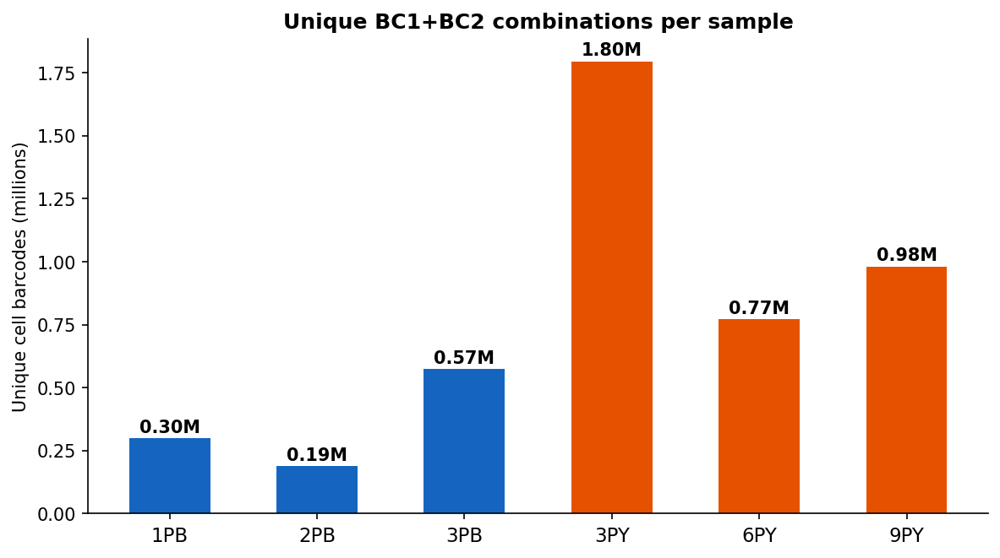
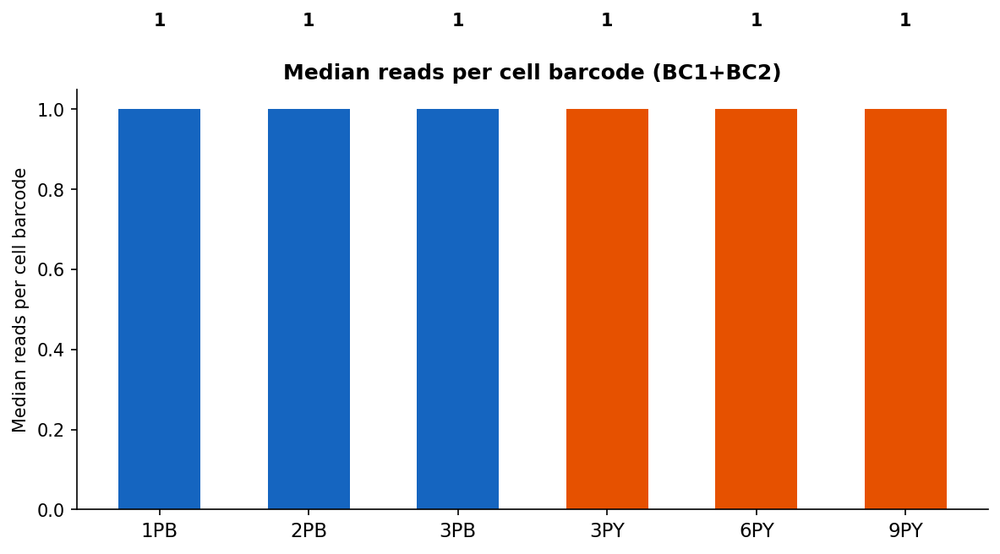
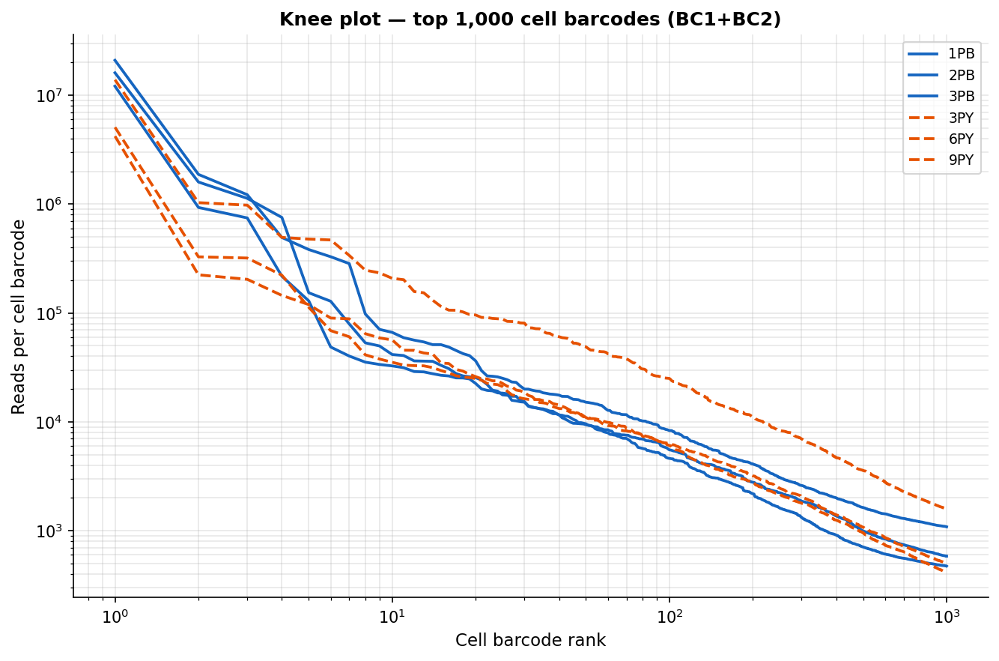

# Barcode Statistics Report

**Input:** filter_HD2 R1 reads (HD≤2 + W1 exact hit + gap=20)  
**Cell barcode:** BC1 (10 bp) + BC2 (10 bp) = 20 bp combined (CB)

---

## 1. Summary Table

| Sample | Total reads | Unique BC1 | Unique BC2 | Unique CB | Median reads/CB | Mean reads/CB |
|--------|------------|------------|------------|-----------|-----------------|---------------|
| **1PB** | 19,304,120 | 61,464 | 52,222 | 298,126 | 1 | 64.8 |
| **2PB** | 26,498,256 | 37,546 | 30,733 | 188,647 | 1 | 140.5 |
| **3PB** | 40,101,821 | 89,398 | 78,206 | 573,965 | 1 | 69.9 |
| **3PY** | 37,682,637 | 275,680 | 305,150 | 1,795,272 | 1 | 21.0 |
| **6PY** | 10,561,326 | 166,405 | 191,988 | 771,376 | 1 | 13.7 |
| **9PY** | 12,862,720 | 195,995 | 219,217 | 981,713 | 1 | 13.1 |

---

## 2. Unique Cell Barcodes (BC1+BC2)

---

## 3. Median Reads per Cell Barcode

---

## 4. Knee Plot

Read count vs rank for the top 1,000 cell barcodes (log-log scale).  
A steep drop-off indicates a clear separation between real cells and background.

---

## 5. Observations

- PB samples have 188,647–573,965 unique cell barcodes; PY samples have 771,376–1,795,272.
- Median reads per CB: PB 1–1, PY 1–1.
- The knee plot shape indicates whether a clear cell/background boundary exists. A sharp elbow suggests good library complexity; a flat curve suggests many low-count barcodes.
- High unique CB counts with low median reads per CB typically indicate a large fraction of background/empty droplets — downstream cell calling (e.g., ArchR, snapATAC2) will apply a count threshold to separate real cells.