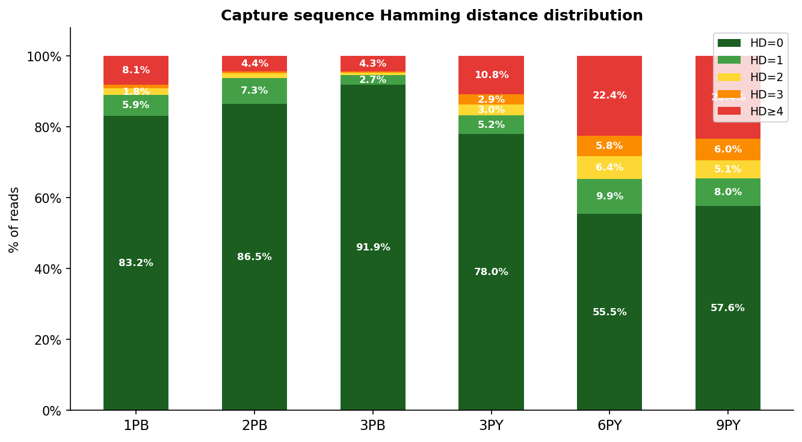
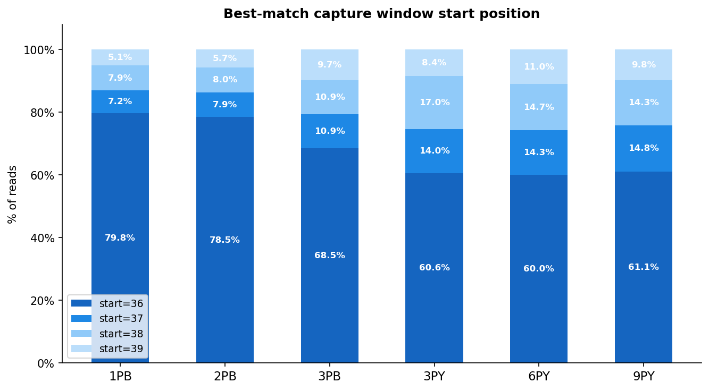
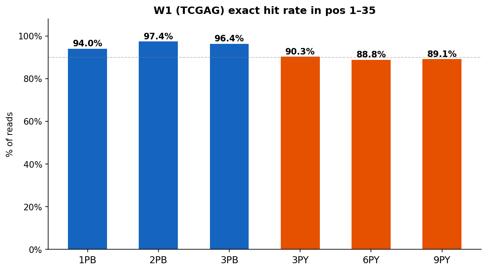
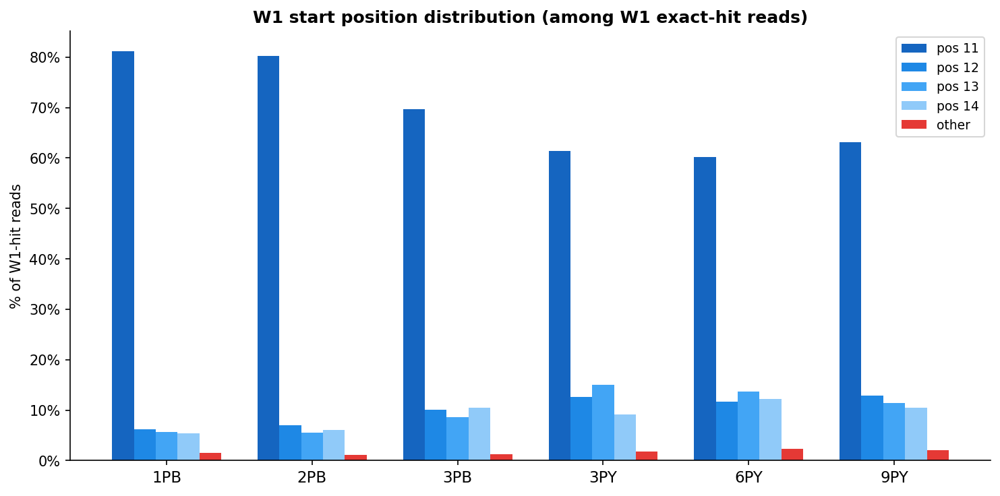
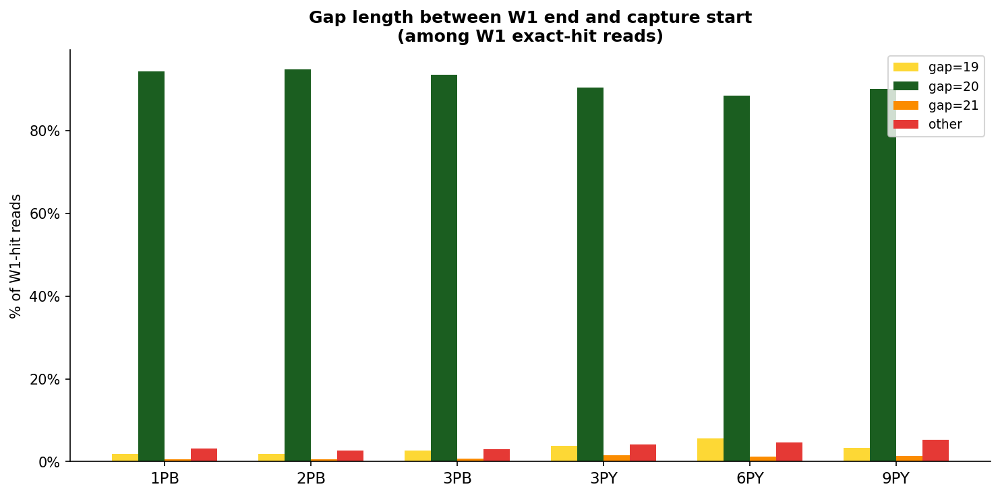
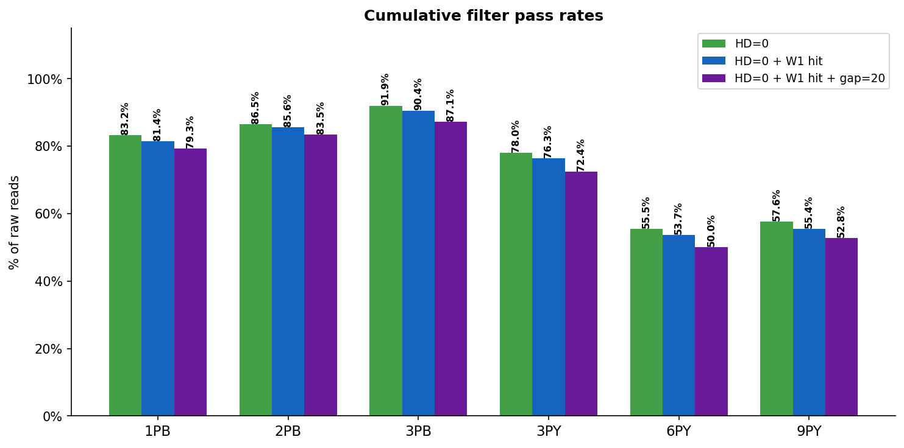
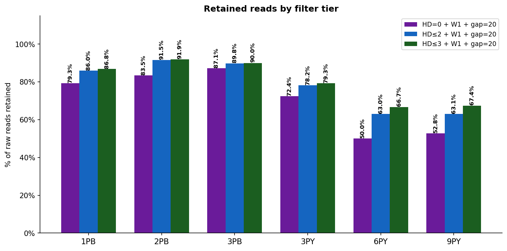
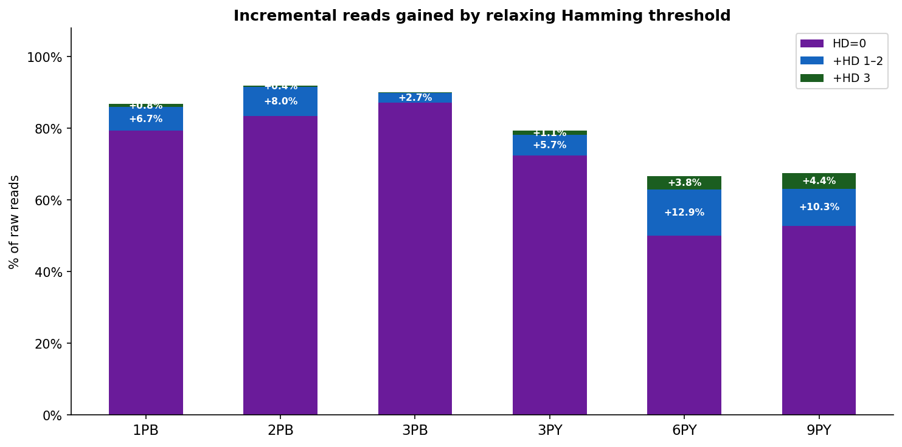

# Round3 Metadata QC Report

**Input:** raw R1 reads (all 6 samples)  
**Capture scan windows (1-based closed):** [36,50] [37,51] [38,52] [39,53]  
**W1 search region:** pos 1–35  

---

## 1. Capture Sequence Hamming Distance

Minimum Hamming distance across the four scan windows.
HD=0 means at least one window has an exact match.

| Sample | HD=0 | HD=1 | HD=2 | HD=3 | HD≥4 |
|--------|------|------|------|------|------|
| **1PB** | 83.2% | 5.9% | 1.8% | 1.1% | 8.1% |
| **2PB** | 86.5% | 7.3% | 1.3% | 0.5% | 4.4% |
| **3PB** | 91.9% | 2.7% | 0.7% | 0.4% | 4.3% |
| **3PY** | 78.0% | 5.2% | 3.0% | 2.9% | 10.8% |
| **6PY** | 55.5% | 9.9% | 6.4% | 5.8% | 22.4% |
| **9PY** | 57.6% | 8.0% | 5.1% | 6.0% | 23.4% |

---

## 2. Best-Match Capture Window Start Position

Which of the four candidate windows (pos 36/37/38/39) yielded the minimum Hamming distance.

| Sample | start=36 | start=37 | start=38 | start=39 |
|--------|----------|----------|----------|----------|
| **1PB** | 79.8% |  7.2% |  7.9% |  5.1% |
| **2PB** | 78.5% |  7.9% |  8.0% |  5.7% |
| **3PB** | 68.5% |  10.9% |  10.9% |  9.7% |
| **3PY** | 60.6% |  14.0% |  17.0% |  8.4% |
| **6PY** | 60.0% |  14.3% |  14.7% |  11.0% |
| **9PY** | 61.1% |  14.8% |  14.3% |  9.8% |

---

## 3. W1 Exact Hit Rate

Exact match of `TCGAG` in pos 1–35 of R1.

| Sample | W1 hit | W1 miss | Hit rate |
|--------|--------|---------|----------|
| **1PB** | 21,114,970 | 1,339,432 | **94.0%** |
| **2PB** | 28,193,762 | 757,592 | **97.4%** |
| **3PB** | 43,031,693 | 1,619,359 | **96.4%** |
| **3PY** | 43,530,861 | 4,672,350 | **90.3%** |
| **6PY** | 14,895,598 | 1,880,775 | **88.8%** |
| **9PY** | 18,167,975 | 2,224,361 | **89.1%** |

---

## 4. W1 Start Position Distribution

Among reads with a W1 exact hit, which position the W1 was found at.
Canonical position is 11; positions 12–14 indicate a 1–3 bp prefix before BC1.

| Sample | pos 11 | pos 12 | pos 13 | pos 14 | other |
|--------|--------|--------|--------|--------|-------|
| **1PB** | 81.1% | 6.2% | 5.6% | 5.4% | 1.6% |
| **2PB** | 80.2% | 7.0% | 5.5% | 6.1% | 1.1% |
| **3PB** | 69.7% | 10.1% | 8.6% | 10.4% | 1.2% |
| **3PY** | 61.4% | 12.7% | 15.0% | 9.2% | 1.8% |
| **6PY** | 60.1% | 11.7% | 13.7% | 12.2% | 2.3% |
| **9PY** | 63.1% | 12.9% | 11.5% | 10.5% | 2.1% |

---

## 5. Gap Length Distribution

Number of bases between W1 end and capture start, among W1-hit reads.  
Expected value: **20** (BC2 10bp + UMI 2bp + common_fixed 8bp).

| Sample | gap=19 | gap=20 | gap=21 | other |
|--------|--------|--------|--------|-------|
| **1PB** | 1.9% | 94.3% | 0.6% | 3.1% |
| **2PB** | 1.8% | 94.8% | 0.6% | 2.7% |
| **3PB** | 2.7% | 93.6% | 0.8% | 2.9% |
| **3PY** | 3.8% | 90.5% | 1.5% | 4.1% |
| **6PY** | 5.6% | 88.6% | 1.2% | 4.7% |
| **9PY** | 3.4% | 90.1% | 1.3% | 5.2% |

---

## 6. Cumulative Filter Pass Rates

Three progressively stricter filter tiers, each expressed as % of raw reads.

| Sample | HD=0 | HD=0 + W1 hit | HD=0 + W1 hit + gap=20 |
|--------|------|---------------|------------------------|
| **1PB** | 83.2% (18,675,929) | 81.4% (18,268,863) | **79.3%** (17,803,091) |
| **2PB** | 86.5% (25,053,398) | 85.6% (24,769,175) | **83.5%** (24,168,807) |
| **3PB** | 91.9% (41,018,177) | 90.4% (40,352,971) | **87.1%** (38,904,553) |
| **3PY** | 78.0% (37,593,268) | 76.3% (36,780,253) | **72.4%** (34,922,692) |
| **6PY** | 55.5% (9,312,332) | 53.7% (9,003,098) | **50.0%** (8,390,020) |
| **9PY** | 57.6% (11,744,653) | 55.4% (11,303,736) | **52.8%** (10,766,742) |

---

## 7. Filter Comparison

Three filter tiers applied to raw reads. All tiers require W1 exact hit and gap=20.
The only variable is the maximum allowed Hamming distance for the capture sequence.

### 7.1 Absolute pass counts and rates

| Sample | Raw reads | HD≤0 + W1 hit + gap=20 | HD≤2 + W1 hit + gap=20 | HD≤3 + W1 hit + gap=20 |
|--------|-----------|---|---|---|
| **1PB** | 22,454,402 | **17,803,091** (79.3%) | **19,304,120** (86.0%) | **19,488,527** (86.8%) |
| **2PB** | 28,951,354 | **24,168,807** (83.5%) | **26,498,256** (91.5%) | **26,612,886** (91.9%) |
| **3PB** | 44,651,052 | **38,904,553** (87.1%) | **40,101,821** (89.8%) | **40,185,454** (90.0%) |
| **3PY** | 48,203,211 | **34,922,692** (72.4%) | **37,682,637** (78.2%) | **38,232,403** (79.3%) |
| **6PY** | 16,776,373 | **8,390,020** (50.0%) | **10,561,326** (63.0%) | **11,194,199** (66.7%) |
| **9PY** | 20,392,336 | **10,766,742** (52.8%) | **12,862,720** (63.1%) | **13,752,627** (67.4%) |

### 7.2 Incremental reads gained by relaxing the Hamming threshold

Reads added relative to the strictest filter (HD=0).

| Sample | HD=0 baseline | +HD 1–2 (HD≤2 gain) | +HD 3 (HD≤3 gain) |
|--------|--------------|---------------------|-------------------|
| **1PB** | 17,803,091 (79.3%) | +1,501,029 (+6.7%) | +184,407 (+0.8%) |
| **2PB** | 24,168,807 (83.5%) | +2,329,449 (+8.0%) | +114,630 (+0.4%) |
| **3PB** | 38,904,553 (87.1%) | +1,197,268 (+2.7%) | +83,633 (+0.2%) |
| **3PY** | 34,922,692 (72.4%) | +2,759,945 (+5.7%) | +549,766 (+1.1%) |
| **6PY** | 8,390,020 (50.0%) | +2,171,306 (+12.9%) | +632,873 (+3.8%) |
| **9PY** | 10,766,742 (52.8%) | +2,095,978 (+10.3%) | +889,907 (+4.4%) |

### 7.3 Observations

- Relaxing from HD=0 to HD≤2 recovers an additional fraction of reads where the capture sequence has 1–2 sequencing errors — likely true positive reads with minor sequencing noise.
- Relaxing further to HD≤3 adds a smaller incremental gain; the trade-off is accepting reads where 3 of 15 capture bases are incorrect (20% error rate), which may include more false positives.
- PY samples consistently show lower pass rates across all tiers, consistent with lower library quality observed throughout the pipeline.